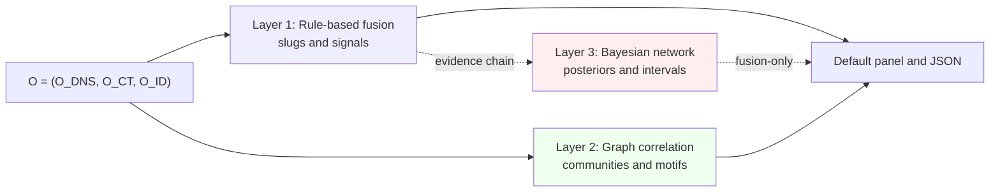
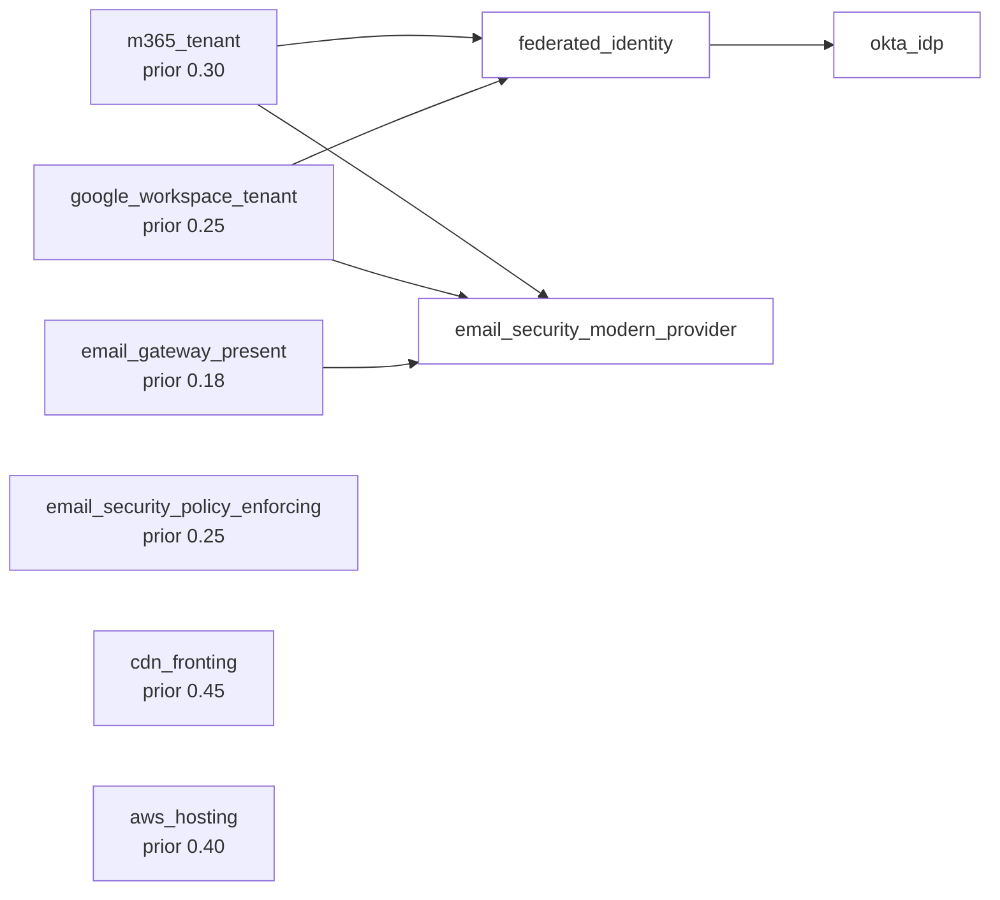
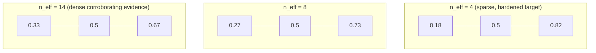

# Correlation engine

**Audience.** Security architects, researchers, and contributors who
want to understand *why* and *how* recon extracts structural signal from
strictly public observables. Casual users should rely on the
[README](../README.md) and `--explain` output. This is the
technical reference for the correlation engine. The v2.0 schema lock
has shipped and the Bayesian layer is stable; this reference is current
as of v2.2.x and is maintained alongside the code rather than frozen.

## 1. Overview

**TL;DR.** recon ingests three classes of public observables (DNS,
certificate transparency, and unauthenticated identity-discovery
endpoints) and runs three layered correlation engines on top of them:
deterministic rule-based fusion, deterministic graph correlation
(Louvain communities, chain motifs, hypergraph ecosystem view), and a
small probabilistic Bayesian network (v1.9, stable v2.0+). The
contract throughout is **provenance + calibration**: every conclusion
is traceable through the evidence DAG, sparse evidence stays sparse,
and "we cannot tell from this channel" is a valid result. We do not
claim to recover an underlying ground-truth tech stack; we report how
much the public channel constrains the residual uncertainty about it.

The [README](../README.md) is the accessible introduction for casual
users; [roadmap.md § Invariants](roadmap.md#invariants) is the
authoritative invariant list. This section states the recurring
epistemic commitments once: every conclusion is reachable through the
evidence DAG (provenance); sparse evidence produces wider hedges and,
where applicable, wider credible intervals (calibration honesty);
"we cannot tell from this channel" is a valid output; and nothing is
learned at runtime, the fingerprints and CPTs ship as data files with
no learned weights (see §6). Later sections cite back here rather than
restating these.

**Who this is for, and where else to look.** This is the technical
reference for architects, researchers, and contributors who want the
model and its rationale. For other needs: operators reading a result
should use [README.md](../README.md) plus §5.2, the worked
`--explain-dag` output in §4.15, and the concern-to-field lookup in
§6.1; integrators building on the JSON or MCP surface want
[schema.md](schema.md) and [mcp.md](mcp.md) for exact field contracts;
readers weighing assurance and limits want [limitations.md](limitations.md)
with §4.7 (validation) and §4.5 (the passive-observation ceiling).

### 1.1 What recon is doing, and what it is not

recon is an **external attack-surface management (EASM) instrument**
for defenders. The premise: the defender has already applied legal
and technical obscurity to their own public footprint. The question
recon answers is *how much of that footprint is still observable to
anyone with public DNS and certificate-transparency access*, that is,
how effective the obscurity is in practice.

The observables we work from are deliberately narrow:

  - $O_{\mathrm{DNS}}$: DNS RRsets (A, CNAME, MX, NS, TXT, SPF, DMARC,
    DKIM, BIMI).
  - $O_{\mathrm{CT}}$: CT log entries (issuer, SAN sets,
    `not_before` timestamps).
  - $O_{\mathrm{ID}}$: unauthenticated identity-discovery endpoints
    (Microsoft 365 OIDC + GetUserRealm, Google Workspace).

The full observation tuple is $O = (O_{\mathrm{DNS}}, O_{\mathrm{CT}},
O_{\mathrm{ID}})$. Strictly passive: no probes beyond standard
public-DNS resolution and no credentials (the full invariant set,
including the no-learned-weights and no-imported-intelligence
commitments, is in §6 and [roadmap.md § Invariants](roadmap.md#invariants)).

### 1.2 Vocabulary

Two terms appear throughout and have specific meanings:

  - **Slug**: a stable identifier emitted by the deterministic
    fingerprint catalog (e.g. `microsoft365`, `okta`, `cloudflare`).
    Each slug is anchored in one or more YAML rules under
    `recon_tool/data/fingerprints/` that match against $O$.
  - **Signal**: a higher-order rule defined in
    `recon_tool/data/signals/` that fires conditional on slug sets,
    record patterns, or `requires`/`min_matches` predicates. Signals
    are observations *about* the slug evidence (e.g. `dmarc_reject`,
    `federated_sso_hub`).

A *node* in the v1.9 Bayesian network is yet another level up: a
high-level structural claim ("the tenant is M365-federated") whose
evidence bindings reference slugs and signals. The three abstractions
are intentionally layered, not merged; §4 develops the network
formally.

### 1.3 Why these layers are separate (and stay separate)

A reasonable external critique reads the architecture as
"fingerprints → signals → optional Bayesian overlay" and proposes
collapsing it into one unified probabilistic model. We do not, and
the reason is structural rather than aesthetic:

  - **Slugs are the evidence layer.** Each slug is a falsifiable
    statement about $O$ (e.g. "this domain has an MX pointing to
    `aspmx.l.google.com`"). Slugs are what an auditor verifies by
    re-running the underlying DNS or CT query. They have to be
    addressable on their own, because the project's defensive posture
    is "every conclusion is reachable through the evidence DAG."
  - **The Bayesian network is the inference layer.** Nodes here are
    *latent* claims about the organization ("M365-federated tenant")
    that no single observable settles. They are the place
    where probabilistic reasoning belongs, and the v1.9 layer is
    confined to this scope on purpose.
  - **Signals are the presentation layer.** They are operator-facing
    rollups that compose slug evidence into named ideas the operator
    already has a mental model for ("DMARC reject," "federated SSO
    hub"). They are not inference primitives; they are *views over*
    the evidence layer. Their value is that a security architect can
    cite `dmarc_reject` in a ticket without forcing every reader to
    re-derive it from RRsets.

Collapsing these three into one model is technically possible but
would erase the audit surface. An auditor who can only read posterior
probabilities, without being able to point at the slug that fired,
the network node it bound to, or the named signal a colleague is
referring to, cannot reconstruct the argument. That is the failure
mode the layering exists to prevent, and it is why the project does
not adopt unified-PGM proposals that ask signals to "disappear or
become queries over the posterior": the presentation layer exists
for humans, and removing it would tax every operator who uses the
tool to write a finding. Sections 3.1-3.7 stay deterministic for the
same reason: a deterministic conclusion is auditable in a way a
black-box posterior is not, even when the posterior is numerically
more honest.

### 1.4 What this document does *not* claim

To preempt a reasonable critique: we do not claim recon optimizes any
information-theoretic objective end-to-end. The pipeline is
hand-crafted feature extractors and a fixed graphical model, not a
trained system that maximizes anything. The phrase "extracts residual
mutual information" describes the *intent* of the correlation work,
not an explicit objective being optimized over the tool's parameters.
Where we use the language of latent variables, posteriors, and
credible intervals (§4), it applies *only* to the discrete Bayesian
network defined in `bayesian_network.yaml`, not to the whole
pipeline. Sections 3.1-3.7 are deterministic; their outputs do not
carry posterior semantics.

### 1.5 Why the design choices are what they are

A defender's hardening strategy reduces how much structural
information the public channel reveals. recon's correlation work is
the counter-strategy: surface what still leaks. Each shipped feature
is a heuristic feature extractor over $O$. We did not derive these
extractors from an optimisation; we picked them because they recover
specific structural signals that single-source detection misses on
hardened targets (wildcard SAN siblings, temporal CT bursts, chain
motifs, SAN co-occurrence communities, network-propagated claims).

The two hard constraints that govern every extractor are the
provenance and calibration-honesty commitments stated in the §1
intro above. Everything else (the lack of telemetry, the
data-file-only schema for fingerprints/CPTs, the opt-in
`--fusion`-gated Bayesian layer) falls out of them.

This is also why the Bayesian layer is deliberately small and
hand-specified rather than learned. A reader can mistake that for a
limitation; it is the precondition for what the layer can promise. The
suppression proposition (§4.3) rests on every binding being a hand-set
positive indicator with an inspectable likelihood, a property a learned
model could not certify, and the evidence DAG is auditable only because
no weight is fit at runtime. The smallness is what buys the proof and
the provenance, not a capability the layer gave up.

## 2. The three correlation layers

Three layers ship side-by-side, in increasing order of statistical
machinery:

1. **Deterministic rule-based fusion** (the default path). Per-source
   evidence is merged into per-slug detections via explicit YAML rules.
   Output is a slug list with three-bucket confidence (`low / medium /
   high`) and full provenance through `--explain`. This is what the
   default panel reflects, and what every JSON consumer can rely on
   regardless of flags.
2. **Deterministic graph correlation** (v1.8.0, always emitted).
   Louvain community detection over the CT SAN co-occurrence graph
   plus chain-motif matching plus the batch-scope hypergraph view.
   Deterministic given a fixed Louvain seed; runs alongside the
   rule-based fusion without changing it.
3. **Probabilistic Bayesian-network fusion** (v1.9.0, `--fusion`-gated,
   stable v2.0+). Variable-elimination inference
   over a small discrete DAG whose CPTs ship as a YAML data file.
   Surfaces marginal posteriors with 80% credible intervals over
   high-level claims (M365 tenant, federated identity,
   email-security provider presence, email-security policy
   enforcement, CDN fronting, and so on; see §4 for the full
   nine-node topology). The deterministic layer 1 still runs
   first; the Bayesian layer adds calibrated uncertainty without
   replacing the default output shape.

The three layers are complementary, not replacements for one another:
rule-based fusion is the audit-friendly authority for "did we observe
X?"; the graph layer is the structural lens (modularity, community
boundaries, motif hits) that a single-cert view does not recover; the
Bayesian layer is the calibrated-uncertainty lens that refuses to
overclaim when the public channel is thin. Sections 2.5 and 4 develop
the graph and Bayesian layers in detail.



Layer 1 is the authority for "did we observe X?" and feeds the
default panel. Layer 2 is always emitted into a top-level
infrastructure_clusters envelope, never gated. Layer 3 reads the
already-collected evidence chain (no new network calls) and
contributes posteriors only when `--fusion` is set.

Architecture:

  - `recon_tool/sources/dns.py`: collects DNS observables and the
    CNAME chains used by the surface-attribution pipeline.
  - `recon_tool/sources/cert_providers.py`: pulls CT entries from
    crt.sh and CertSpotter; surfaces SAN sets and basic cert summary
    statistics.
  - `recon_tool/fusion.py`: multi-source evidence merge into per-slug
    detections.
  - `recon_tool/merger.py`: deduplicates SourceResults into a single
    TenantInfo with full provenance and a `MergeConflicts` record when
    sources disagree.
  - `recon_tool/signals.py`: applies YAML rules (`requires`,
    `min_matches`, `expected_counterparts`) to produce signal-layer
    observations on top of fingerprint slugs.
  - `recon_tool/absence.py`: negative-space rules. When *expected*
    evidence is absent, surface the absence as an observation.
  - `recon_tool/posture.py`: neutral aggregation into the posture
    panel (Email / Identity / Infrastructure / SaaS / Consistency).
  - `recon_tool/clustering.py`: simple related-domain grouping for
    batch mode and chain expansion.
  - `recon_tool/discovery.py`: surface-attribution and gap-mining
    layer added in v1.5; the building block the discovery loop
    (`recon discover`, `validation/scan.py`) sits on top of.
  - `recon_tool/explanation.py`: provenance DAG serialization for
    `--explain` and the MCP `explanation_dag` field.
  - `recon_tool/motifs.py` (v1.7+): CNAME chain motif catalog and
    matcher; surfaced as the top-level `chain_motifs` array.
  - `recon_tool/infra_graph.py` (v1.8+): CT co-occurrence graph
    builder + Louvain community detection (via pure-Python `networkx`).
    Surfaced as the top-level `infrastructure_clusters` envelope.
  - `recon_tool/ecosystem.py` (v1.8+): batch-scope hypergraph builder
    over per-domain results. Behind `recon batch --json --include-ecosystem`.

For most domains, deterministic fusion is the right tool: fast,
explainable, auditable, and sufficient for the high-confidence cases.
The cases it misses are the hardened ones (minimal DNS, randomized
CNAMEs, short-lived certs, wildcard SAN policies), which is where the
graph and Bayesian layers do their work. The table in §2.5 states
each layer's reach and limits in one place.

### 2.5 What each layer can and cannot resolve

| Layer | Resolves well | Limits |
|---|---|---|
| **Rule-based fusion** (default, deterministic) | Direct slug attribution from authoritative observables (OIDC tenant, DKIM signing, MX provider, vendor-specific TXT). High-precision when the channel publishes anything. | Misses hardened targets that publish nothing. No notion of "claim X is uncertain"; output buckets are `low/medium/high`. |
| **Graph correlation** (v1.8, deterministic, always emitted) | Structural signal across multiple domains: SAN co-occurrence communities, chain motif matches, ecosystem-level co-membership across a batch. Recovers vendor-order pattern when individual labels are randomized. | Operates on the *observed* graph: gives no ownership claim, only co-membership / co-issuance / co-motif. Modularity score is the calibrated handle on partition quality; low score is reported, not hidden. |
| **Bayesian network** (v1.9, `--fusion`, stable v2.0+) | Calibrated posterior + 80% credible interval over a small set of high-level claims (M365 tenant, federated identity, modern email security, etc.) with cross-source-conflict dampening. Sparse-evidence cases produce wide intervals rather than confident-looking point estimates. | Posterior quality is bounded by CPT specification: a wrong CPT produces a tight interval around the wrong mean. Network is small (9 nodes at v1.9.3+; 20-node design budget) and intentionally so. Held opt-in through v1.9.x; v1.9.4 hardened-adversarial calibration, v1.9.5 per-node stability dispositions, and the v1.9.10 stratified-corpus revalidation cleared the path to v2.0. See `validation/v1.9.4-calibration.md`, `validation/v1.9.5-stability.md`, `validation/v1.9.10-pre-lock.md`. |

When `--fusion` is set, both `slug_confidences` (from the older Beta
layer) and `posterior_observations` (the v1.9 network layer)
populate; the graph layer's `infrastructure_clusters` envelope is
emitted regardless of flags.

## 3. Deterministic correlation

Each engine below is a feature extractor over $O$ that recovers
information single-source detection misses on hardened targets. Each
lands as a YAML schema extension plus minimal engine code, stays
inside the invariants ([roadmap.md § Invariants](roadmap.md#invariants)),
and the graph engines (§§ 3.5-3.7) ship gated as noted. §§ 3.1-3.4
shipped in v1.7.0 (hardened-target signal recovery); §§ 3.5-3.7
shipped in v1.8.0 (graph correlation). The Bayesian layer (§4) is
separate.

### 3.1 Wildcard SAN sibling expansion

When a CT entry contains `*.example.com`, the rest of the SAN list in
that same certificate is a candidate sibling set. Wildcards exist to
collapse SAN inventory; the surrounding SAN entries in the same
issuance are still public. Each sibling lands as `related_domains`
evidence with type `ct_san_sibling` and the source cert's
`not_before`. Hedged: "issued together; common ownership not
implied", since same-cert SAN sets are sometimes shared across tenants of
the same hosting provider.

*Defender use:* quantify how much subdomain inventory remains
observable through CT despite a wildcard policy.

### 3.2 Temporal CT issuance bursts

Treat issuance as a point process. For a given apex or issuer, the
timestamps $\{t_1, \dots, t_n\}$ are observable. A *burst* is a
connected component of the inter-arrival graph with edge threshold
$\Delta t < \tau$ (DBSCAN-style; $\tau$ on the order of minutes for
typical deployment cadence). Co-issued subdomains within a burst
become directed edges in the evidence DAG, weighted by
$w_{ij} \propto 1/\Delta t_{ij}$. Output language is neutral:
"co-issued within $\tau$ seconds", never "same owner".

*Defender use:* detect deployment cadence even when individual
hostnames are randomized or short-lived.

### 3.3 CNAME / NS chain motifs

Each resolution path is a directed string $\pi(d) = h_1 \to h_2 \to
\dots \to h_k$. A motif library (added in v1.7.0) at
`recon_tool/data/motifs.yaml` describes recurring vendor-order
patterns: `cloudflare → akamai → custom-origin`,
`fastly → azure-fd`, intra-vendor `tm → azurefd → msedge`, etc.
Pattern matching is regex over the chain string with chain length
capped at 4. Vertical absence rules can also fire on motifs.

*Defender use:* observe that randomized intermediate labels do not
hide a recurring vendor ordering.

### 3.4 Cross-source evidence conflict surfacing

`MergeConflicts` records when two sources disagree on a merged field
(display name, auth type, region, tenant ID, DMARC policy, Google auth
type). v1.7.0 promotes them to a top-level `evidence_conflicts` array
in `--json` and a section in `--explain`. v1.9 feeds the conflict
count into the Bayesian dampener (§4.4).

*Defender use:* surface drift between hardening signals: minimal DNS
that disagrees with public CT, or MX that contradicts SPF. A future
trust-validated BIMI identity source may also support identity-name conflict
checks; the current document probe does not treat an unverified subject as
identity.

### 3.5 CT co-occurrence graph + Louvain community detection

Build an undirected multi-graph $G_{\mathrm{CT}} = (V_{\mathrm{CT}}, E_{\mathrm{CT}})$:
$V_{\mathrm{CT}}$ are domains observed in CT SAN sets, $E_{\mathrm{CT}}$
are weighted by shared cert ID, shared issuer, and temporal
proximity (the burst rule from §3.2). Run Louvain community
detection ([Blondel et al. 2008](https://doi.org/10.1088/1742-5468/2008/10/P10008))
via pure-Python `networkx`, maximizing modularity:

$$Q = \frac{1}{2m} \sum_{ij}\left[A_{ij} - \frac{k_i k_j}{2m}\right] \delta(c_i, c_j).$$

Louvain over Leiden because Leiden's well-connectedness guarantees
([Traag et al. 2019](https://doi.org/10.1038/s41598-019-41695-z)) pay
off on dense million-node graphs; our cluster passes cap at ~500
nodes where the partition-quality difference is negligible, and
`leidenalg` would pull in C extensions we don't need. Output is a
partition $\{C_1, \dots, C_k\}$ and the modularity score $Q$: high
$Q$ means a meaningful boundary, low $Q$ means a coin flip; both
report honestly.

*Defender use:* validate that PKI segmentation holds at the public
observation layer, not just the internal one.

##### Resolution limit and the CPM refinement

Modularity maximisation has a mathematically proven failure mode
known as the **resolution limit**
([Fortunato and Barthélemy 2007, PNAS](https://doi.org/10.1073/pnas.0605965104)):
the null-model penalty $k_i k_j / 2m$ in the modularity objective
$Q = \frac{1}{2m} \sum_{ij} [A_{ij} - k_i k_j / 2m] \delta(c_i, c_j)$
depends on the total edge weight $2m$ of the global graph, so
communities smaller than approximately $\sqrt{2m}$ edges cannot be
recovered: they get artificially merged into larger neighbouring
clusters even when they are well-separated by edge structure.

For the global CT ecosystem this matters concretely. A small
enterprise PKI cluster of a few-dozen domains is at risk of being
swallowed by a multi-tenant hosting-provider cluster (Cloudflare,
AWS, GoDaddy edges) under standard modularity maximisation,
because the global $2m$ is dominated by the shared-hosting edges.

Two design choices mitigate this in recon:

1. **Per-apex subgraph scope.** The surface-attribution pipeline
   operates on the related-domain CT subgraph for one queried
   apex, not on the global CT graph. The resolution-limit
   threshold $\sqrt{2m}$ scales with the subgraph's total edge
   weight, which is dramatically smaller than the global graph's,
   so the threshold below which communities disappear is
   correspondingly smaller. Resolution limit still applies; it
   just bites at a much smaller community size.
2. **Temporal-proximity weighting (from §3.2).** Edges weighted
   by burst-rule co-issuance reinforce tight short-time-window
   clusters relative to ambient co-occurrence. This shifts the
   effective resolution downward for enterprise PKI deployed in
   bursts.

The principled in-scope refinement is the **Constant Potts Model
(CPM)** variant of the modularity objective from
[Traag, Waltman, and van Eck 2019, "From Louvain to Leiden:
Guaranteeing Well-Connected Communities"](https://doi.org/10.1038/s41598-019-41695-z),

$$Q_{\text{CPM}} = \sum_{ij} \left[ A_{ij} - \gamma \right] \delta(c_i, c_j),$$

which replaces the global-edge-weight null model with a constant
resolution parameter $\gamma$. By tuning $\gamma$ the partition
algorithm respects small community boundaries regardless of
global graph density. CPM is implementable in pure Python on the
existing `networkx` graph; it does not require the `leidenalg`
C extension that v1.8.0 declined to take a dependency on
(the [Leiden algorithm itself](https://doi.org/10.1038/s41598-019-41695-z)
is a separate optimisation strategy with well-connectedness
guarantees; the CPM quality function and the Leiden algorithm are
orthogonal and either can be used with either). Adopting CPM as
an alternative objective behind a `--graph-resolution` flag is a
candidate refinement listed in the post-v2.0 backlog.

Until that work lands, the operator-facing safeguard is the
modularity score $Q$ surfaced alongside the partition: when $Q$
is low the partition is poorly resolved and the boundary should
be read as suggestive rather than load-bearing.

##### Where the mitigations still fail: hub-dominated subgraphs

The mitigations above reduce the resolution-limit threshold but
do not eliminate it, and a specific failure mode survives. When a
per-apex subgraph contains a single high-degree hub (a CDN like
Cloudflare, Akamai, or Fastly with thousands of co-issuance
edges), the hub's degree $k_{\mathrm{hub}}$ approaches $2m$ for the
subgraph. The modularity null-model penalty
$k_A \cdot k_{\mathrm{hub}} / 2m$ for any small cluster $A$ with
even one edge to the hub collapses toward $k_A$, meaning the
expected-edge baseline becomes degenerate. Even a small enterprise
PKI cluster with a single CT co-issuance edge into the hub gets
swallowed by the hub's community, regardless of subgraph scope or
temporal weighting.

This is not a flaw in the implementation; it is a structural
property of modularity maximisation on graphs with heavy-tailed
degree distributions. Modularity maximisation is mathematically
equivalent to fitting a **Planted Partition Model**, a restricted
form of the Stochastic Block Model (SBM) that assumes homogeneous
degree distributions within communities
([Peixoto 2021, "Descriptive vs. inferential community detection
in networks: pitfalls, myths and half-truths" (Physical Review E)](https://doi.org/10.1103/PhysRevE.103.052305)).
Internet infrastructure graphs have heavy-tailed degree
distributions by construction (a small number of CDNs and hosting
providers are connected to nearly every domain), so the Planted
Partition assumption is structurally wrong for our setting. The
modularity score $Q$ being honest about resolution failure is the
best the current objective function can do; the *right* answer
is to fit a degree-corrected SBM and pick communities via
Minimum Description Length inference.

The principled future-work path is **MDL inference on the
degree-corrected Stochastic Block Model** (Peixoto's framework
in the `graph-tool` library). This treats community detection as
Bayesian model selection: fit a degree-corrected SBM, recover
communities that the data supports under a statistically
consistent model, not under modularity's restricted null. The
trade-off is that `graph-tool` is a C++ extension, which crosses
the pure-Python dependency floor. A pure-Python implementation of
SBM-MDL is a post-v2.0 candidate, listed in the roadmap.

The honest current-state framing for an operator: the §3.5
partition is sound when modularity $Q$ is high *and* no hub
dominates the subgraph; when either condition fails, the
community boundary should be treated as a starting point for
manual investigation, not as a finding.

##### Relationship to parallel passive-DNS graph work

The closest contemporary system is cGraph
([Daluwatta, De Silva, Kariyawasam, Nabeel, Elvitigala, De Zoysa,
and Keppitiyagama, 2022](https://arxiv.org/abs/2202.07883)),
which constructs a heterogeneous graph from passive DNS (A, NS,
MX, CNAME, SOA records) plus VirusTotal labels plus MaxMind
geolocation, and runs belief propagation seeded by labeled
benign/malicious domains to assign maliciousness scores to
unlabeled nodes. The reported figures are 92% precision and
99% recall on a private benchmark.

recon takes the same input class (passive DNS plus CT) but does
not assign maliciousness scores. The architectural difference is
deliberate and falls out of the project invariants:

- **No external label feed.** cGraph seeds belief propagation
  from VirusTotal positives and Alexa rankings. recon ships no
  shared reputation database (roadmap.md § Invariants), so
  there are no seeds to propagate from.
- **No "is this malicious" verdict.** A maliciousness score is a
  judgment about the *operator behind* a domain, not about
  observable structure. recon's correlation layer outputs
  structural co-membership (these domains co-issue, this chain
  matches a vendor-order motif, this SAN set clusters) which is
  observable; verdicts about operators are not.
- **No belief propagation between adjacent domains.** Two
  domains sharing a CT cluster do not imply trust transfer in
  either direction; recon reports the cluster boundary and
  modularity score and lets the operator decide what the
  boundary means.

cGraph and recon answer different questions on similar input.
cGraph asks "is this domain malicious?" and uses graph inference
to label. recon asks "what structure exists in the public
footprint of these domains?" and uses graph inference to
surface that structure. A defender reading this should not
expect recon to flag malicious infrastructure; that task lives
in dedicated threat-intelligence platforms with explicit label
feeds.

### 3.6 Hypergraph ecosystem view (batch-only)

For corpus runs, treat the batch as a hypergraph $\mathcal{H} = (V, \mathcal{E})$:
hyperedges $e \in \mathcal{E}$ connect domains sharing an issuer, a
fingerprint slug set ($|\mathrm{slugs}(e)| \geq 3$), or a trust-validated BIMI
VMC organization when one is supplied. Hyperedge size encodes "how many co-located
organizations sit behind the same broadcast signature". Surfaced
behind `--include-ecosystem`. Describes observed co-membership; not
ownership.

*Defender use:* multi-brand orgs see ecosystem-level coupling
invisible from any single domain's view.

### 3.7 Vertical-baseline anomaly rules

Profile YAML files define an expected fingerprint distribution per
profile (fintech, healthcare, high-value-target, etc.). At runtime we compare the
observed signal mix against the baseline. The simplest formulation
is a KL-divergence proxy over vertical-relevant slugs; in practice
we ship readable absence rules (`expected: WAF`,
`expected: identity_provider`) and surface the deviation neutrally
("fintech profile expects WAF motif; not observed"). Anomalies are
observations, not verdicts.

*Defender use:* sanity-check posture against industry norms encoded
as data, without recon ever asserting "you should do X".

## 4. The Bayesian fusion network

The Bayesian layer (v1.9; stable v2.0+) is a small discrete graphical model
$\mathcal{B} = (V_\mathcal{B}, E_\mathcal{B}, \Phi)$ committed as a
YAML data file at `recon_tool/data/bayesian_network.yaml`. The model
is intentionally minimal (fewer than twenty nodes for the seed
network) because the goal is calibrated uncertainty over a handful
of high-level claims, not a comprehensive ontology of public
infrastructure. We make no claim that the network is the right
abstraction; we claim only that *given* the abstraction, the
inference is exact and the calibration is honest.

**Validation history.** The layer approached the v2.0 lock through six
named validation steps documented per release: the v1.9.4
hardened-adversarial corpus (50 domains across five hardening
postures; `validation/v1.9.4-calibration.md`), the v1.9.5 per-node
stability dispositions (eight of nine nodes classified `stable`
against behavioural criteria; `validation/v1.9.5-stability.md`),
the v1.9.6 topology fix that closed the one `not yet` node
(`validation/v1.9.6-stability-update.md`), the v1.9.7+v1.9.8
catalog metadata pass that brought every detection in every
category to a non-empty description, scope-narrowing language,
and a canonical vendor `reference` URL
(`validation/v1.9.8-metadata-audit.md`), the v1.9.9 detection-gap
UX surfaces backed by 167 new tests plus a publicly-reproducible
synthetic corpus generator
(`validation/v1.9.9-detection-gap-ux.md`), and the v1.9.10
stratified-corpus pre-lock validation across six cloud strata
(`validation/v1.9.10-pre-lock.md`,
`validation/v1.9.10-bayesian-revalidation.md`). The
catalog-metadata pass is upstream of the inference layer (it
governs what the slug observations $O$ in §3.5 represent) but
load-bearing for the layer's auditability: every fingerprint match
that flows into the network has a vendor-doc citation, so a
defender re-reading the inference output can re-verify the
underlying detection without grepping the source. See §4.12 for
the per-release calibration narrative.

### 4.1 Generative model

Each node $X \in V_\mathcal{B}$ is a binary latent variable with state
space $\{\text{present},\ \text{absent}\}$ representing a structural
claim ("the tenant is M365-federated", "email security is composite-
strong", "a CDN fronts the apex"). Each node has a conditional
probability table

$$\phi_X(X \mid \mathrm{Pa}(X)) = P(X \mid \mathrm{Pa}(X))$$

over its parents $\mathrm{Pa}(X)$, with the joint factorising in the
usual way:

$$P(V_\mathcal{B}) = \prod_{X \in V_\mathcal{B}} \phi_X(X \mid \mathrm{Pa}(X)).$$

Observables enter through *evidence bindings*. Each node $X$ has
zero or more bindings $b \in B(X)$, each pointing at a slug or signal
emitted by the deterministic pipeline. Conditional on $X$, the
binding's likelihood is

$$\ell_b(X) = \begin{cases}
   \alpha_b & \text{if } X = \text{present} \\
   \beta_b  & \text{if } X = \text{absent}
\end{cases}, \qquad \alpha_b, \beta_b \in (0, 1).$$

We restrict $\alpha_b, \beta_b$ to the open interval to keep all factors
strictly positive: hard-evidence likelihoods $\{0, 1\}$ would produce
degenerate factors that under-estimate uncertainty (a single
mis-fingerprint would pin a node permanently). The schema enforces
this at load time.

#### Virtual evidence vs. observed-variable conditioning

Worth naming the construction explicitly: each $\ell_b$ is a
**virtual-evidence** factor in the sense of
[Pearl 1988 §2.3.3](https://www.cambridge.org/core/books/probabilistic-reasoning-in-intelligent-systems/0AA7BFAA1A4B5C9C6B68A4D4C8DB1C8E)
(also Koller & Friedman §3.7.2), not a classical observed-variable
clamp. In a standard Bayesian network with hard evidence on
observable variable $B$, we condition by clamping $B = b_{\text{obs}}$
and renormalising. Here there is no observable variable in the
network at all. The binding $b$ lives in the deterministic
pipeline, fires there based on patterns in $O$, and enters the
Bayesian layer only as a multiplicative factor $\psi_b(X) =
\ell_b(X)$ over the latent node $X$ it points at. The deterministic
pipeline determines which bindings fire; the Bayesian layer
consumes those firings as virtual-evidence factors. This separation
is intentional and load-bearing: it keeps the deterministic
pipeline auditable on its own terms (a binding fires or does not,
based on a falsifiable pattern in $O$) and confines the
probabilistic content to the inference layer.

This framing also makes §4.3's asymmetric likelihood a forced
choice rather than an aesthetic one. Virtual-evidence factors are
multiplicative; un-fired bindings simply do not enter $\Phi_{\text{ev}}$
in the first place. The question "what likelihood does a
non-fired binding contribute?" is a category error under
virtual-evidence semantics, because there is no observable
variable whose negative state is being conditioned on.

#### Concrete excerpt

This is the actual YAML the inference engine loads:

```yaml
nodes:
  - name: m365_tenant
    description: "Domain has a Microsoft 365 / Entra tenant."
    prior: 0.30
    evidence:
      - slug: microsoft365
        likelihood: [0.95, 0.03]   # P(observed | present), P(observed | absent)
      - slug: entra-id
        likelihood: [0.88, 0.02]
      - slug: exchange-online
        likelihood: [0.85, 0.02]

  - name: federated_identity
    description: "Domain uses an external IdP for SSO."
    parents: [m365_tenant, google_workspace_tenant]
    cpt:
      "m365_tenant=present,google_workspace_tenant=present": 0.50
      "m365_tenant=present,google_workspace_tenant=absent":  0.45
      "m365_tenant=absent,google_workspace_tenant=present":  0.35
      "m365_tenant=absent,google_workspace_tenant=absent":   0.08
    evidence:
      - signal: federated_sso_hub
        likelihood: [0.90, 0.05]

  - name: okta_idp
    description: "Identity provider is Okta."
    parents: [federated_identity]
    cpt:
      "federated_identity=present": 0.30
      "federated_identity=absent":  0.005
    evidence:
      - slug: okta
        likelihood: [0.92, 0.02]
```

Read top-down: a tenant is M365 with prior probability 0.30; given
the modern-mail-provider state, federation is present with
probability 0.45 when only M365 is observed (and 0.35 when only GWS
is observed, since federation is less common on GWS-native deployments
because GWS-native auth is often used directly); given federation,
Okta is the IdP with conditional probability 0.30. The numbers are
tunable and committed as data (see §6).

#### Network topology (v1.9.3)



Nine nodes total. Five roots (priors only); four children (CPTs).
`email_security_modern_provider` has three parents because the path
through M365, GWS, and email-gateway each contribute differently to
the *provider-presence* claim. `email_security_policy_enforcing` is
a separate root because policy enforcement is provider-independent
(see §4.9 for the v1.9.3 split rationale).

### 4.2 Inference: variable elimination

#### Factor-graph view

The model has a clean factor-graph reading. Define the factor set
$\Phi = \Phi_{\text{CPT}} \cup \Phi_{\text{ev}}$ as the disjoint
union of two factor families:

- $\Phi_{\text{CPT}} = \{\phi_X : X \in V_\mathcal{B}\}$, one
  factor per network node, scoped over $\{X\} \cup \mathrm{Pa}(X)$,
  with values given by the CPT row $P(X \mid \mathrm{Pa}(X))$. Root
  nodes contribute a degenerate one-variable factor $\phi_X(X) = P(X)$
  (the prior).
- $\Phi_{\text{ev}} = \{\psi_b : b \in O\}$, one factor per fired
  evidence binding, scoped over the bound node $\mathrm{node}(b)$,
  with $\psi_b(X) = \ell_b(X)$ from §4.1.

Given an observed-evidence set $O = \{b : b \text{ fired for the queried domain}\}$,
the joint over the latent claims factorises as

$$P(V_\mathcal{B},\ O) \;=\; \prod_{\phi_X \in \Phi_{\text{CPT}}}
\phi_X(X \mid \mathrm{Pa}(X))
\;\cdot\; \prod_{\psi_b \in \Phi_{\text{ev}}} \psi_b(\mathrm{node}(b))$$

and the marginal posterior over any node $X$ is the standard
factor-graph query

$$P(X \mid O) \;=\; \frac{1}{Z}\sum_{V_\mathcal{B} \setminus \{X\}}
\prod_{\phi \in \Phi} \phi(\cdot)
\;=\; \frac{1}{Z} \sum_{V_\mathcal{B} \setminus \{X\}}
P(V_\mathcal{B}) \cdot \prod_{b \in O} \ell_b(\mathrm{node}(b))$$

where $Z = \sum_{V_\mathcal{B}} P(V_\mathcal{B}) \cdot \prod_{b \in O} \ell_b$
is the normalising constant for the evidence-conditioned model.

The implementation maintains this representation:
`recon_tool/bayesian.py` constructs one factor per CPT row and one
per fired binding via `_factor_for_node` and `_factor_for_evidence`,
then sums out non-query variables one at a time in `_query_marginal`.

#### Algorithm and complexity

We compute the marginal exactly by variable elimination
([Zhang & Poole 1994](https://www.aaai.org/Library/AAAI/1994/aaai94-203.php),
[Koller & Friedman 2009 §9](https://mitpress.mit.edu/9780262013192);
see §17.4 for the formal exact-inference complexity bound in
terms of the treewidth of the moralised graph). The time
complexity of variable elimination is

$$T(n, w, d) = O(n \cdot d^{w + 1})$$

where $n$ is the number of variables, $w$ is the treewidth of the
moralised graph induced by the elimination order, and $d$ is the
state size. At $n = 9$, $w = 3$ (bounded by the maximum number of
co-parents, three for `email_security_modern_provider`), and
$d = 2$ (binary nodes), this works out to about $9 \cdot 2^{4} =
144$ multiply-add operations per query, which matches the
sub-millisecond runtime we observe.

We use a deterministic elimination order (lexicographic on node
names) for reproducibility: it is not optimal in general (the
min-fill and min-weight heuristics are the standard alternatives;
see [Kjaerulff 1990](https://doi.org/10.1007/BFb0014153) for the
historical reference, K&F §9.4 for the textbook treatment, and
[Tamaki 2022, "Heuristic Computation of Exact Treewidth"](https://arxiv.org/abs/2202.07793)
for the recent computational refinement that wins PACE-style
treewidth competitions) but our deterministic-lexicographic
ordering is tractable at this scale and gives bit-identical
outputs run-to-run.

#### What "current scale" really means: treewidth, not node count

The operative scaling parameter for variable elimination is
**treewidth**, not node count. Treewidth is highly sensitive to
edge density: a small number of nodes with dense multi-parent
CPTs can produce a much higher $w$ than a larger number of nodes
with sparse parent sets. The current $n = 9$, $w = 3$, 144-op
figure is derived above.

If a future schema change adds dense evidence bindings, for
instance a node with five or more parents whose CPT does not
factor cleanly, $w$ can grow well before $n$ reaches 20. At
$w = 5$ the operation count jumps to about $9 \cdot 2^6 \approx
576$; at $w = 10$ it jumps to $\sim 20{,}000$, which still runs
under a millisecond on modern hardware but starts compressing
margins. The 20-node figure is a heuristic stand-in; the real
threshold is "treewidth past 5 with non-trivial $n$."

For high-treewidth networks the architectural pivot is knowledge
compilation: compile the network to a tractable circuit at build
time, making query-time exact marginal inference treewidth-independent.
The roadmap backlog item "Scaling exact inference past treewidth
handling" tracks this path; the trigger is a CPT shape that pushes
treewidth past 5, not a 20th node.

The implementation is pure Python, no numpy, no probabilistic
programming framework. We chose the small footprint deliberately:
adding a heavyweight inference dependency would obscure what is
actually a few hundred lines of straightforward factor manipulation.
For larger networks the code generalizes; we will reach for
`pgmpy` or similar only when the current implementation no longer
fits in a single readable module.

### 4.3 The asymmetric likelihood: why we never condition on absence

The asymmetric likelihood is forced by a **missing-data assumption**,
not chosen for engineering convenience. In the classical Rubin (1976)
taxonomy of missing-data mechanisms, three regimes are
distinguishable:

- **MCAR** (missing completely at random): the probability that a
  binding fires is independent of the latent state $X$.
- **MAR** (missing at random): firing probability depends on
  *observed* covariates but not on $X$ once those are controlled
  for.
- **MNAR** (missing not at random): firing probability depends on
  $X$ itself, often through an unobserved mechanism.

Symmetric conditioning, that is, multiplying by $1 - \ell_b(X)$ when
the binding does *not* fire, is the correct Bayesian update under
MCAR or MAR. Under MNAR it is biased, and the direction of the bias
is toward whichever absences the missingness mechanism produces.

recon's defensive setting is MNAR by design. When a hardened
operator strips a public OIDC discovery endpoint, the absence of
the `microsoft365` slug is *not* random: it is correlated with the
latent `m365_tenant` claim through the operator's deliberate
hiding choice. A symmetric model cannot distinguish that case
from genuine absence and so produces overconfident posteriors
against $X$ on exactly the targets recon must refuse to overclaim
about (Rubin 1976; Mohan and Pearl 2021,
["Graphical Models for Processing Missing Data"](https://doi.org/10.1080/01621459.2021.1874961)).

The model is therefore intentionally one-sided: positive bindings
update the posterior toward presence; non-firing bindings leave
the posterior where the priors and parent-claims placed it.
Formally: the likelihood factor for a node $X$ is the product
over *only* the bindings that fired,

$$L(O \mid X) = \prod_{b \in O \cap B(X)} \ell_b(X),$$

with the un-fired bindings contributing nothing.

#### The $LR = 1$ equivalence

A reviewer reading the model in symmetric-Bayesian terms will ask
what likelihood ratio (LR) recon is implicitly assigning to the
*absence* of a binding. The answer is exactly 1:

$$\frac{P(\neg b \mid X = \text{present})}{P(\neg b \mid X = \text{absent})} = 1.$$

This is a stronger claim than MNAR alone. MNAR says the missingness
mechanism depends on $X$; the $LR = 1$ equivalence is the stronger
statement that under recon's setting the missingness mechanism is
dependent on $X$ in a specific way: an absent binding provides no
discriminatory power between two scenarios, $X$ is truly absent, or
$X$ is present and the operator has hidden the indicator.

The trade-off, made explicit:

- Under **symmetric Bayesian conditioning** the absence LR would be
  $(1 - \alpha_b) / (1 - \beta_b)$. For
  `signal:dkim_present` with $\alpha_b = 0.85$ and $\beta_b = 0.30$
  this is $0.15 / 0.70 \approx 0.21$, meaning absence carries
  information against $X$ at a moderate rate.
- Under recon's **asymmetric (virtual-evidence) construction** the
  absence LR is 1, meaning absence carries no information either way.

We accept the cost. In well-instrumented domains (no hiding,
complete public surface), the asymmetric model under-claims
presence relative to a symmetric model that correctly exploits
absence. In adversarial domains the symmetric model over-claims
absence as confirming absence and produces false-negative verdicts.
recon's input distribution is dominated by partially or fully
hardened targets, so the asymmetric trade is on the right side of
the bias-conservatism axis for the threat model. The $LR = 1$
equivalence is the precise mathematical content of "we do not
condition on absence" and the implication the layer commits to.

#### Adversarial-missingness derivation via m-graphs

The cleanest formal derivation for $LR = 1$ in recon's setting
comes from the **missingness-graph (m-graph)** framework of
[Mohan and Pearl 2021, "Graphical Models for Processing Missing
Data"](https://doi.org/10.1080/01621459.2021.1874961). An m-graph
augments the Bayesian network with one extra binary masking
indicator $R_E$ for each potentially-missing evidence variable $E$.
The observed value is $E^{\ast} = E$ when $R_E = 0$ and
$E^{\ast} = \text{missing}$ when $R_E = 1$. The dependence structure of
$R_E$ on the rest of the network determines whether the missingness
is MCAR, MAR, or MNAR, and whether the latent state is recoverable
from the observed data.

For recon's setting the $R_E$ variable is *under adversarial
control*. The hardened operator chooses what to publish and what
to hide; their hiding choice is a function of $X$ (they hide
$E$ specifically because $X$ is present), so the masking mechanism
decouples the observed $E^{\ast}$ from the true latent $X$.

When the masking mechanism is adversarial and unknown, the latent
state is only *partially identified*: the observed data is consistent
with a range of posteriors, not a point ([Manski 2003, *Partial
Identification of Probability Distributions*](https://doi.org/10.1007/978-0-387-21789-9)).
The robust-observer choice is to report the prior, treating the
missingness as perfectly uninformative,

$$P(X \mid E^{\ast} = \text{missing}) = P(X),$$

which is exactly the $LR = 1$ claim above; recon's
$n_{\mathrm{eff}}$ interval-widening under sparse evidence is the
marginal-level realisation of those Manski bounds. The construction
is also consistent with Jeffrey-style updating on one-sided evidence
([Jeffrey 1965](https://www.cambridge.org/core/books/logic-of-decision/B6AC0F4DDDF6E2BCB8985CB7CB7E1B59)),
the cautious-updating treatments in imprecise-probability theory
([Walley 1991](https://www.crcpress.com/Statistical-Reasoning-with-Imprecise-Probabilities/Walley/p/book/9780412286604);
[Augustin et al. 2014](https://onlinelibrary.wiley.com/doi/book/10.1002/9781118763117)),
and forensic Bayesian networks where evidence is one-sided by design
([Taroni et al. 2014](https://onlinelibrary.wiley.com/doi/book/10.1002/9780470665879)).
No novelty is claimed; the framework exists, the rationale is the
same as recon's (passive, adversarial-hardening setting), and the
choice is annotated in `recon_tool/bayesian.py` so future
contributors who reach for symmetric conditioning read the
rationale first.

#### The suppression guarantee: a monotonicity property

The $LR = 1$ rule is not only a modelling choice; it buys a provable
adversarial property, the one formal result recon leans on. State it
first in plain terms: **an operator who hides indicators can only move a
claim toward "we cannot tell," never toward a confident wrong answer.**
The rest of this subsection makes that precise and proves it.

Fix a node $X$ and hold all evidence outside $X$'s own bindings fixed.
Write $\Omega_X^{0} = P(X=\text{present}\mid\varnothing_{\mathrm{obs}}) /
P(X=\text{absent}\mid\varnothing_{\mathrm{obs}})$ for the **prior baseline
odds**: the message $X$ receives from its priors, parents, and children
when none of its own observation factors is applied. Reduce $X$'s bindings
to evidence *units*, where a unit is one independent binding or one
mutually-exclusive group (the reduction that keeps co-firing readings from
being over-counted is §4.3 below, "Conditionally-dependent bindings"). Each
unit $u$ contributes one factor to $X$'s observation likelihood, with
present/absent odds ratio $\rho_u$ that depends on what was observed:

- a unit whose binding **fired** contributes $\rho_u = \alpha_u/\beta_u
  \ge 1$, where $\alpha_u = \ell_u(\text{present})$, $\beta_u =
  \ell_u(\text{absent})$;
- a unit that **did not fire** contributes $\rho_u = 1$ on a hideable node
  (absence is not conditioned on), or a disconfirming $\rho_u \le 1$ on a
  declarative node (absence is informative: the independent complement
  $(1-\alpha_u)/(1-\beta_u)$, or the group's explicit `group_absence`
  ratio).

The observation factor enters $X$'s marginal multiplicatively, so in
variable elimination $X$'s posterior odds factor as

$$\frac{P(X = \text{present} \mid \mathrm{obs})}{P(X = \text{absent} \mid \mathrm{obs})}
  \;=\; \Omega_X^{0} \, \prod_{u} \rho_u .$$

This factorisation is exact when $X$ is an evidence-isolated root. When $X$ has
parents or children, external evidence rescales $\Omega_X^{0}$ (and so $B_X$)
and couples slightly through the polytree, so the equality is no longer
literal; what survives, and is all the proposition needs, is that the
observation factor $\prod_u \rho_u$ is non-decreasing in the fired set. The
harness therefore checks the conclusion directly across a sweep of
external-evidence contexts (`validation/adversarial_properties.py`) rather than
relying on the clean factorisation.

Define the node's **suppression floor** $B_X$ as the posterior reached when
none of $X$'s bindings fire, every unit sitting at its not-fired factor. For
a **hideable** node every not-fired ratio is $1$, so $B_X$ is the prior
baseline $\Omega_X^{0}/(1+\Omega_X^{0})$. For the **declarative** node the
not-fired ratios are $\le 1$, so $B_X$ sits *below* the prior baseline: the
policy node with no DMARC, SPF, or MTA-STS signal has an all-absent
posterior of about **0.055**, not its **0.62** prior, because the absence of
a public declaration is itself disconfirming (§4.3 below, "Node-dependent
missingness"). $B_X$ is the quantity the harness reads as
`post[frozenset()]`.

The catalogue enforces that every fired binding is a *positive indicator*:
$\alpha_u \ge \beta_u$, equivalently $\lambda_u = \log(\alpha_u/\beta_u)
\ge 0$ (a fired slug favours presence); on a declarative node it also
enforces that each not-fired factor is disconfirming,
$\rho_u^{\,\mathrm{absent}} \le 1$ (a missing public declaration favours
absence). These are the proposition's hypotheses, checked as standing
invariants (`validation/adversarial_properties.py`).

> **Proposition (suppression monotonicity).** Let $F$ be the bindings that
> fired and $F' \subseteq F$ any subset an operator leaves visible after
> hiding the rest. Under the hypotheses above, with all other evidence
> fixed,
> $$B_X
>   \;\le\; P(X = \text{present} \mid F')
>   \;\le\; P(X = \text{present} \mid F).$$
> Suppression moves the presence-posterior monotonically down toward the
> suppression floor $B_X$ and never above the fully-observed value. For a
> hideable node $B_X$ is the prior baseline; for the declarative node it is
> the strictly lower all-absent posterior.

*Proof.* For an independent unit, hiding its binding replaces $\rho_u \ge 1$
with the not-fired ratio $\rho_u^{\,\mathrm{absent}}$, which is $1$ on a
hideable node and $\le 1$ on a declarative one. For a grouped unit the fired
ratio is $\rho_u = \max_{b \in F \cap u} \alpha_b/\beta_b$, the strongest
co-fired member (by `_contributing_evidence`): hiding a non-strongest member
leaves $\rho_u$ unchanged, hiding the strongest drops it to the
next-strongest, and only hiding the last member moves the unit to its
not-fired ratio. Either way each hiding step weakly decreases that unit's
ratio ($\rho_u^{\,\mathrm{absent}} \le \rho_u$ by the positive-indicator and
disconfirming-absence invariants) and leaves every other unit's ratio
unchanged, so it weakly decreases the product $\prod_u \rho_u$. The
odds-to-probability map $\omega \mapsto \omega/(1+\omega)$ is increasing,
giving monotone descent and the upper bound at $F$. Hiding all of $F$ leaves
every unit at its not-fired ratio, which is by definition $B_X$, giving the
lower bound. The product is the observation factor only; for a parented node
the external rescale of $\Omega_X^{0}$ is a positive constant within a fixed
external context, so the descent holds in every context, which the harness
confirms by sweeping them. $\blacksquare$

Two corollaries carry the security content.

*No suppression-induced false positive.* There is no hiding strategy
$F' \subseteq F$ with $P(X = \text{present} \mid F') > P(X = \text{present}
\mid F)$. An adversary deleting public indicators cannot raise the
presence-posterior above what the unhidden channel supports, so confident
"present" cannot be manufactured by hiding.

*Suppression is visible on hideable nodes.* On a hideable node the effective
sample size $n_{\mathrm{eff}}$ is non-decreasing in the contributing-binding
count (§4.4), and the credible-interval half-width is decreasing in
$n_{\mathrm{eff}}$, so hiding weakly *widens* the 80% interval: the act of
suppression raises the reported uncertainty rather than passing unseen. This
corollary is specific to hideable nodes. On the declarative node it runs the
other way, and by design: there $n_{\mathrm{eff}}$ counts informative
*absences* (`_declarative_evidence_count`), not fired bindings, so suppressing
a public declaration is itself evidence. Hiding the lone strict-SPF binding on
the policy node *narrows* the half-width (about 0.34 to about 0.18) and yields
a confident low posterior (about 0.055, not flagged sparse), a confident "not
enforcing." That still obeys the proposition (the posterior moved down toward
$B_X$), but it is the opposite of "hiding widens," and it is the correct
reading: a public declaration an operator withholds is genuine
disconfirmation, not a hidden truth, which is the whole point of treating that
node as declarative.

The declarative policy node is the one place $B_X$ falls below the prior:
its signals are public declarations an operator cannot *hide*, so
suppressing them is genuine disconfirmation that drives the posterior down
to about 0.055. The same node can still be pushed *up* by a forged
declaration; that is the addition side below, which the proposition does
not bound.

**The asymmetry: removal versus addition, which is not the passive/active
line.** The proposition bounds the *removal* of evidence. It says nothing
about the *addition* of evidence, and that gap, not the passive/active
line, is the real boundary of the guarantee. An operator who publishes a
record that fires unit $u$ adds a factor $\rho_u \ge 1$ and raises the
posterior on a premise recon cannot check without sending traffic to the
service, which the strictly-passive, zero-credential invariant forbids
(§6). The tempting shorthand, that the guarantee boundary is the
passive/active line, is wrong: publishing a decoy TXT record, SPF include,
or CNAME is fully passive on the operator's side and on recon's side (recon
re-reads a genuine, tier-1 "Observed" fact), costs nothing, and lands a
confident false positive. So the same passive posture that makes recon safe
to *point at* an untrusted target does not make it safe *from* a target
that plants. Stated as the contract: *robust to evidence removal, exposed
to evidence addition*; the older "robust to hiding, not to lying" phrasing
holds only if "lying" is read to include truthful-but-decoy records. The
deception-posture catalogue (§4.11) records the cheapest addition-side
pattern (Pattern I, a static decoy verification token, which defeats the
highest-confidence bindings at zero cost); the addition side is larger than
that one pattern, because additions compose through the DAG (a planted
parent binding lifts a child's floor) and cascade across nodes, neither of
which the one-node proposition bounds.

Read through the threat model, the proposition says recon structurally
avoids a *confident false negative* from suppression. A hideable node with
no fired evidence returns its baseline with a wide interval (the
identifiability floor, §4.5), never a confident "absent," so hiding yields
"we cannot tell," not a false "they are clean." The residual exposure is
the false *positive* an addition can plant (§4.11), which is catalogued,
not claimed away. The monotonicity and the bounds, with $B_X$ the
all-absent floor recomputed per context, are verified over every per-node
binding subset under a sweep of representative external-evidence contexts in
`validation/adversarial_properties.py` (the contexts exercise each node's
Markov blanket, since the floor and the realized odds depend on the external
evidence), so the property ships as a machine-checked invariant; the proof
above is its justification, not the check.

#### What is actually hideable: the operator/provider spectrum

The suppression proposition is a worst case: it grants the operator the power
to delete any binding. Real bindings differ in how freely they can be
deleted, and the difference is itself defensive information that lets
recon do better than the worst case on the claims that matter most.

- **Operator-vanity bindings.** Records published purely as a hint, with
  no functional load: an autodiscover CNAME, a domain-verification TXT.
  These delete for free, and the MNAR worst case applies in full.
- **Operator-functional bindings.** Records that route a live service.
  The MX RRset is the canonical case: delete it and the apex receives no
  mail. An operator running Microsoft 365 mail on the apex therefore
  cannot silently drop the MX; they can only repoint it at a mail
  gateway, which fires `email_gateway_present` and is itself observed.
  The absence of an MX is then not "no signal" but the positive fact "no
  direct mail on this apex," which constrains the claim rather than
  vacating it. Hiding a functional binding carries a service cost, so it
  is rarer than hiding a vanity one, and it tends to *relocate* the
  evidence rather than erase it.
- **Provider-attested bindings.** Signals served not by the operator but
  by the platform the operator depends on. The Microsoft 365
  tenant-discovery endpoints (the unauthenticated OIDC metadata and
  GetUserRealm responses at `login.microsoftonline.com`, keyed on the
  domain) report whether a domain is a tenant *from the provider's own
  registry*, in both directions: a resolved tenant ID or a
  Managed/Federated namespace attests presence, and the documented
  tenant-not-found response (OIDC HTTP 400, NameSpaceType Unknown)
  attests absence. The operator does not control those responses, and
  querying them contacts Microsoft rather than the target, so it stays
  passive with respect to the target while reading an authoritative
  answer the target cannot suppress. To make the endpoint stop attesting
  a tenant the operator has to actually leave the tenant, which is a
  functional change, not concealment. The Google Workspace channel is
  weaker and one-sided, and the distinction matters: recon's passive
  Google probe (the login-routing classification) attests a Workspace
  tenant only when a federated-IdP redirect is actually observed, never
  attests a managed tenant, and has no authoritative negative - so it is
  provider-*behavioral* evidence, not a registry answer, and it cannot
  serve as a two-class reference label.

The consequence sharpens the tier picture in
[statistical-assurance.md](statistical-assurance.md). A node whose
load-bearing evidence is provider-attested is not "hideable
infrastructure" in the worst-case sense: like the declarative DMARC node,
it has an external attestor the operator cannot hide, so its tenancy claim
is reference-calibratable - for `m365_tenant` with both label classes
(`validation/tenancy_reference_calibration.py`, which splits predictor and
label by observation channel: the DNS-driven posterior corroborated
against the endpoint attestation), while `google_workspace_tenant` admits
only a one-sided recall check on attested-federated tenants, by the
channel limitation above. The genuinely worst-case nodes are
the ones whose evidence is entirely operator-controlled DNS or CT, where
no external attestor exists, for example a CDN-fronting claim. So a flat
"hideable" label understates the position: the most load-bearing evidence,
provider attestation and functional records, is precisely the evidence
hardest to hide, which is why staying strictly passive still leaves recon
with a firm footing on the high-value claims.

#### Conditionally-dependent bindings and the over-counting correction

The likelihood factor $L(O \mid X) = \prod_{b \in O \cap B(X)} \ell_b(X)$
treats the fired bindings of a node as conditionally independent given $X$.
In log-odds form each fired binding shifts the posterior log-odds of $X$ by
its log-likelihood-ratio

$$\lambda_b = \log \frac{\alpha_b}{\beta_b},$$

and the combined shift is the sum $\sum_b \lambda_b$. The sum is the correct
update when the bindings are conditionally independent given $X$, and it is
biased toward over-confidence when they are not.

recon's highest-coverage nodes break the independence assumption by
construction. The `m365_tenant` bindings `microsoft365`, `entra-id`, and
`exchange-online` are three readings of one underlying fact: a domain that
exposes one usually exposes the others, so conditional on
`m365_tenant = present` they are strongly positively correlated rather than
independent. With $\ell = [0.95, 0.03],\,[0.88, 0.02],\,[0.85, 0.02]$ the
per-binding log-LRs are $\lambda \approx 3.46,\,3.78,\,3.75$ nats; the
independent product sums them to $\approx 11.0$ nats, whereas a correct
treatment of three near-perfectly-dependent readings of one cause contributes
about the strongest alone, $\approx 3.78$ nats. The excess $\approx 7.2$ nats
of log-odds is spurious confidence that pushes the posterior to the extreme and
narrows the 80% credible interval more than three correlated observations
justify.

This is the mirror image of the asymmetric-likelihood conservatism above. The
$LR = 1$ absence rule makes the layer deliberately *under*-confident on
hardened targets that hide indicators; the independent-product assumption makes
it *over*-confident on richly-instrumented targets that expose several
correlated indicators. The two biases act on disjoint parts of the input
distribution, so a validation metric that reports only mean agreement on
instrumented targets (where the deterministic slug fires regardless) does not
surface the over-confidence: it appears only in interval width, which the
agreement metric does not test.

The dependence-aware correction declares correlated bindings as an *evidence
group* and lets a group contribute a single effective log-LR rather than the
sum. Treating within-group bindings as perfectly dependent given $X$ (the
conservative bound) makes a group $g$ contribute

$$\lambda_g = \max_{b \in g} \lambda_b,$$

recovering the "one cause, one observation" semantics, while bindings in
different groups (genuinely independent signals) still multiply. This is the
standard remedy for redundant evidence in a naive-Bayes-style combiner:
correlated tests are not independent confirmations. The grouping is committed
as data on each node, so the dependence structure stays auditable rather than
learned. Implemented in `recon_tool/bayesian.py`; ungrouped bindings keep the
independent-product behaviour, so the correction is a strict refinement on the
nodes that declare groups. As shipped, the grouped nodes are `m365_tenant`
(`m365_indicators`), `google_workspace_tenant` (`gws_indicators`), `aws_hosting`
(`aws_indicators`, over the `aws`, `aws-cloudfront`, and `aws-route53` facets of
one "runs on AWS" fact), `email_gateway_present` (`gateway_vendors`, over the
near-mutually-exclusive gateway products), and the mutually-exclusive DMARC pair
on `email_security_policy_enforcing` (`dmarc_policy`). Before `aws_hosting` and
`email_gateway_present` were grouped, a target exposing all three AWS facets was
pinned to about 0.9998 with a near-zero interval; grouping pulls that to about
0.947 with a correctly wider band, matching the M365 treatment. `cdn_fronting`
is deliberately left ungrouped: two distinct CDN edges are separable
confirmations of the single "a CDN fronts this" claim, not one fact observed
twice.

#### Node-dependent missingness: MNAR is not universal

The $LR = 1$ absence rule rests on the MNAR claim that an absent binding may be
adversarial hiding rather than genuine absence. That claim is **node-dependent**,
and applying it uniformly miscalibrates the nodes for which it is false. The
Rubin taxonomy this section already invokes makes the distinction precise:

- **MNAR nodes (asymmetric is correct).** Hideable infrastructure such as
  `m365_tenant` or `okta_idp`. A hardened operator can strip the public OIDC
  endpoint or the Okta CNAME, so absence is correlated with the latent state
  through the hiding choice. $LR = 1$ refuses to read that absence as evidence
  of absence.
- **MAR nodes (symmetric is correct).** Public-declaration signals such as the
  `email_security_policy_enforcing` bindings (DMARC reject / quarantine,
  MTA-STS enforce, strict SPF). These are published in DNS or they are not, and
  there is no adversarial incentive to hide a *weaker* policy; absence is
  genuine. Here the correct update conditions on absence with the complementary
  likelihood $(1 - \alpha_b)/(1 - \beta_b)$, so a missing strong signal (a
  missing `dmarc_reject`, $\alpha = 0.92$) is strong evidence against the claim.

The 2026-06 synthetic calibration measured the cost of the uniform assumption:
`email_security_policy_enforcing` sat at conditional ECE $\approx 0.31$, with the
$[0.85, 0.90)$ reliability bin realizing an empirical rate of $0.166$. The node
said "probably enforcing" and was wrong most of the time in that bin, because it
could not use the absence of the strong DMARC signals as disconfirmation. A
conceptual down-weight of `spf_strict` (a near-ubiquitous hygiene signal that is
weak evidence of full enforcement, from $[0.75, 0.30]$ to $[0.70, 0.45]$) reduced
it to $\approx 0.28$ but did not resolve it, confirming the residual is the
missingness regime, not one binding.

This per-node MAR / symmetric conditioning shipped in v1.9.90 (CAL14). The
`email_security_policy_enforcing` node carries `missingness: declarative` in
`bayesian_network.yaml`, and its observation factor conditions on the absence of
each non-firing declarative unit. The two mutually-exclusive DMARC bindings share
a `dmarc_policy` group with an explicit whole-group absence likelihood, so the
group's absence (a `p=none` or missing policy) is the disconfirmer rather than a
per-binding complement product that would double-count the alternatives; the
independent `mta_sts_enforce` and `spf_strict` use their own complements. The
ripples were handled as this section anticipated: a declarative node's effective
sample size counts informative absences (so a confidently non-enforcing domain
gets a narrow interval around a low posterior, not a wide sparse one), and the
per-node stability criterion moved from "every fired binding raises the posterior
above the all-absent baseline" to "toggling a binding from absent to fired raises
the posterior". The prior and the supporting-signal likelihoods were grounded on
a 2026-06 corpus (enforcing base rate about $0.62$, MTA-STS publication about
$0.06$ rather than the hand-set $0.70$). The synthetic conditional ECE for the
node fell from $\approx 0.31$ to $\approx 0.03$. These are directionally-accurate
corpus-grounded estimates that a periodic maintainer-validation loop re-checks
each release (roadmap PV2), not frozen constants; v2.0 calibration claims gate on
the maximum per-node conditional ECE, not the mean. The design note is in
`validation/cal14-missingness-design.md`.

### 4.4 Credible intervals: calibration over inference

Variable elimination gives us a single posterior $\hat{p} = P(X \mid O)$.
But a point estimate is not enough: a posterior of $0.85$ derived
from one weak observation should not be reported the same way as a
posterior of $0.85$ derived from five corroborating ones. We need an
*evidence-responsive* interval: one whose width reflects how much
evidence the posterior rests on. We say *evidence-responsive* rather
than *calibrated* deliberately; the distinction is made precise under
"What the 80% interval is, and what it is not" below.

The standard approach in conjugate Bayesian analysis is to maintain
$\mathrm{Beta}(\alpha, \beta)$ posteriors over the parameter
directly. Variable elimination with discrete CPTs does not give us
$(\alpha, \beta)$; it gives us a point posterior. We recover an
interval by treating $\hat{p}$ as the mean of an effective
$\mathrm{Beta}(\alpha_{\mathrm{eff}}, \beta_{\mathrm{eff}})$ with
total mass $n_{\mathrm{eff}}$:

$$\alpha_{\mathrm{eff}} = \hat{p} \cdot n_{\mathrm{eff}}, \qquad
  \beta_{\mathrm{eff}} = (1 - \hat{p}) \cdot n_{\mathrm{eff}}.$$

This is the *moment-matching* construction
([Minka 2001](https://tminka.github.io/papers/ep/minka-thesis.pdf) §3
gives the technique in a different context). It is not derived from
the network; it is a calibration *on top of* exact inference (the
heuristic-but-principled status is summed up under the Generalized
Bayesian Inference subsection below). The point of the construction
is to give a two-parameter family with the right mean, whose
interval shape depends only on $n_{\mathrm{eff}}$.

The effective sample size is a deliberately conservative function of
the evidence count and the cross-source conflict count:

$$n_{\mathrm{eff}} = \max\left(n_{\min},\; n_{\min} + n_{\mathrm{ev}} \cdot c_{\mathrm{ev}} - n_{\mathrm{conf}} \cdot c_{\mathrm{conf}}\right)$$

where $n_{\min} = 4$ is the floor (the *passive-observation ceiling*
encoded in the math: even with abundant evidence, we never claim
better than $\mathrm{Beta}(\cdot, \cdot)$ with mass 4, because we
know we are inferring from a public broadcast channel rather than
authoritative inventory), $n_{\mathrm{ev}}$ is the count of bindings
that fired for this node, $n_{\mathrm{conf}}$ is the cross-source
conflict count from §3.4, and $(c_{\mathrm{ev}}, c_{\mathrm{conf}}) =
(1.0, 1.5)$ are the per-record contribution and per-conflict penalty.

The 80% credible interval starts from the central 80% quantile of
$\mathrm{Beta}(\alpha_{\mathrm{eff}}, \beta_{\mathrm{eff}})$. When both
shape parameters are at least one, recon computes that quantile directly
with a local incomplete-beta inversion, without adding scipy. When either
shape parameter falls below one, the equal-tailed Beta interval can exclude
its own mean in the boundary-skewed regime where most recon posteriors
live. In that case recon keeps the validated mean-centered interval

$$\hat{p} \pm z_{0.90} \cdot \sqrt{\frac{\hat{p}(1-\hat{p})}{n_{\mathrm{eff}}}}, \qquad z_{0.90} \approx 1.282,$$

clipped to $[0, 1]$. This hybrid is intentional: the exact path removes
interior approximation error, while the fallback preserves the operational
contract that the interval contains the reported posterior and continues to
pass the CAL8 perturbation-coverage gate. The quantile math is pinned by
`tests/test_bayesian_inference.py::TestCredibleIntervalVsBeta`; the
mean-containment and coverage behavior is pinned by
`tests/test_interval_coverage.py`.

**What the 80% interval is, and what it is not.** It is intended as the
central-80% quantile of the moment-matching $\mathrm{Beta}$ in the
unimodal case, and as a mean-centered interval in boundary-skewed cases
where the central quantile would exclude the posterior. It is *not* a
frequentist coverage interval against the underlying generative
process, because there is no underlying generative process we have
access to (the latent claim is unobserved by design and there is
no ground-truth oracle in the passive setting). The coverage
guarantee that does hold is *conditional* on the construction:
if the moment-matching family is well-specified for the
domain population, the interval covers the true latent
probability at 80% on average.

Until that conditional coverage is checked empirically against a
ground-truth subset (the frequentist-coverage test on the
validation roadmap), we describe the interval as
**evidence-responsive**, not **calibrated**. The two words name
different claims. *Evidence-responsive* is the property that the
interval widens monotonically as evidence thins and narrows as it
accumulates; we prove this by construction below (the Fellaji
data-related principle). *Calibrated* in the Dawid sense is the
stronger claim that an 80% interval contains the truth 80% of the
time in repeated use; that is a coverage statement, and we reserve
the word for what an empirical coverage test demonstrates. The
validation strategy (§4.7) reports agreement and proxy-label
calibration error against the conditional claim, labeled as such,
not coverage against ground truth.

#### Calibration principles the interval satisfies

[Fellaji, Pennerath, Conan-Guez, and Couceiro
(2024)](https://arxiv.org/abs/2407.12211) define two formal
principles any epistemic-uncertainty measure should satisfy. We
adopt them as design contracts for the credible interval, and we
can verify by construction that recon's interval meets both:

1. **Data-related principle: uncertainty is non-increasing as
   evidence grows.** With more bindings firing for a node,
   $n_{\mathrm{ev}}$ increases, $n_{\mathrm{eff}}$ increases, and
   the interval construction produces a strictly narrower interval for
   the same posterior and shape regime. The conflict-penalty term
   $n_{\mathrm{conf}} \cdot c_{\mathrm{conf}}$ is the only
   construct that can widen the interval, and only because
   conflict counts as anti-evidence; it does not violate the
   principle in the no-conflict case.
2. **Model-related principle: uncertainty is non-decreasing as
   model expressiveness grows.** Within a release the network
   topology is fixed, so the principle is vacuously satisfied.
   Across releases, each topology change is documented with its
   calibration impact (v1.9.3 split, v1.9.4 hardened-adversarial
   calibration, v1.9.6 binding removal), and the
   `validation/v1.9.6-stability-update.md` report shows the
   v1.9.6 change moved a node from `not yet` to `stable` without
   widening intervals elsewhere.

Fellaji et al. demonstrate that deep ensembles, MC-Dropout, and
Evidential Deep Learning routinely *violate* both principles
because stochastic gradient descent produces poor posterior
approximations. recon's construction is immune to that failure
mode by design: there is no SGD anywhere in the inference path
(committed as data; see §6). The interval is a deterministic
function of $\hat{p}$ and $n_{\mathrm{eff}}$, and both are
deterministic functions of the observed evidence and the committed
YAML network.

This is the by-construction (not by-training) form of the
evidence-responsive property defined above; it does not promise
the interval is tight or attains 80% coverage in repeated use,
which remains the separate empirical claim reserved for the
coverage test.

#### Relationship to Subjective Logic and the Imprecise Dirichlet Model

The moment-matching Beta with $n_{\mathrm{eff}}$ widening
instantiates the epistemic uncertainty that the **Imprecise
Dirichlet Model**
([Walley 1991](https://www.crcpress.com/Statistical-Reasoning-with-Imprecise-Probabilities/Walley/p/book/9780412286604);
[Augustin et al. 2014](https://onlinelibrary.wiley.com/doi/book/10.1002/9781118763117))
and **Subjective Logic**
([Jøsang 2016](https://link.springer.com/book/10.1007/978-3-319-42337-1);
the deep-learning application is
[Sensoy, Kaplan, and Kandemir 2018](https://papers.nips.cc/paper/2018/hash/a981f2b708044d6fb4a71a1463242520-Abstract.html))
formalise as an ignorance mass $u$ that tends to 1 as evidence
drops toward zero. Rather than maintain interval-valued CPTs or a
Dirichlet per CPT row and propagate through credal-network
inference, recon computes the exact point posterior and widens the
marginal interval at the node level from the evidence and conflict
counts. The trade-off is explicit:

| Treatment | Where uncertainty lives | Inference cost |
|---|---|---|
| Full IDM / Subjective Logic | On every CPT entry as bounded intervals or Dirichlet parameters | Credal-network inference (NP-hard in general; benchmark suite [CREPO, Antonucci et al. 2021](https://arxiv.org/abs/2105.04158) caps at ~10 nodes for exact results) |
| recon's $n_{\mathrm{eff}}$ heuristic | At the marginal posterior level via post-hoc Beta widening | $O(n \cdot d^{w+1})$ exact VE plus $O(n)$ interval construction |

The upgrade path is in the post-v2.0 backlog
(roadmap.md "Imprecise Dirichlet Model for CPT entries" and
"Explicit ignorance mass (epistemic vs aleatoric)").

#### Formal foundation for the conflict-penalty term: Generalized Bayesian Inference

The conflict-penalty term $n_{\mathrm{conf}} \cdot c_{\mathrm{conf}}$
*widens* the interval as conflict count rises, where strict
Bayesian updating would have conflicting evidence shift the mean
rather than widen. The formal home for this is a loss-calibrated
**Generalized Bayesian Inference** update
([Bissiri, Holmes, and Walker 2016, "A General Framework for
Updating Belief Distributions" (JRSS B)](https://doi.org/10.1111/rssb.12158)),
in which the posterior solves

$$P(X \mid O) \;\propto\; \exp\bigl( -\,\mathcal{L}(X, O) \bigr) \cdot P(X),$$

with an engineered bounded loss $\mathcal{L}(X, O)$ replacing the
strict likelihood; Bissiri et al. prove the construction is
coherent for any bounded loss, even when no generative model
corresponds to it. The conflict-penalty term is the loss that
spreads mass back toward the prior when sources disagree, which is
what the $n_{\mathrm{eff}}$ widening does at the interval level. The
two formalisms are complementary: IDM / Subjective Logic justifies
the moment-matching Beta itself, and Generalized Bayesian Inference
justifies the conflict-penalty form. The $n_{\mathrm{eff}}$
construction is heuristic in implementation but principled in form;
the IDM treatment becomes worth its cost the first time corpus runs
show the marginal-only widening is the bottleneck on calibration
quality, not when a reviewer prefers it on aesthetic grounds.

We chose 80% over the more common 95% deliberately: a tighter band
would over-promise coverage we cannot verify against ground truth.
The choice is documented as a fixed module-level constant so
downstream consumers can rely on it.

We acknowledge three open issues in this construction:

1. **The interval is honest about sparsity, not about model
   misspecification.** A wrong CPT produces a tight interval around
   the wrong mean. We have no defense against that other than
   keeping the CPTs human-readable and committing them as data,
   plus the quantitative sensitivity analysis below, which bounds
   how much a single CPT error can move any posterior.
2. **The conflict penalty is global, not per-binding.** A conflict
   anywhere in the merged TenantInfo widens every node's interval,
   not just those whose bindings overlap the conflict. This is
   conservative (it never under-reports uncertainty) but it is
   coarser than ideal. A future iteration could thread per-node
   conflict overlap; we did not do so in v1.9 because the global
   penalty already produces the qualitative behavior the operator
   needs ("conflicts → wider report").

3. **The conflict penalty saturates at the passive-observation floor.**
   Because `min_n_eff` (4) is both the interval floor and the `sparse`
   threshold, the conflict term can only push `n_eff` down to 4, never
   below. Once conflicts overwhelm the fired evidence the interval
   saturates at the mass-4 Beta width (the `n_eff = 4` row in the
   sparse-vs-dense figure below, about [0.18, 0.82] at the midpoint)
   rather than continuing toward maximal ignorance. This is conservative
   for the sparse regime it was tuned on, but it means an adversarial
   posture that manufactures many cross-source conflicts (Pattern G,
   §4.11) drives the report to "we are unsure", not to "we cannot tell".
   Separating the confidence floor from a conflict-driven ignorance mass
   would let heavy conflict widen without bound; the explicit-ignorance-mass
   backlog item (the IDM path above) is the natural home for it.

These limitations are documented in `recon_tool/bayesian.py` so a
future contributor sees them next to the code.

#### Quantitative sensitivity to CPT misspecification

To bound the first limitation, we ran a $\pm 0.10$ perturbation
analysis: for every CPT entry and every root prior, perturb by
$\pm 0.10$ (clipped to $[0.001, 0.999]$), re-run inference on three
canonical evidence patterns (dense M365 stack, dense GWS stack,
empty observation), and record the maximum posterior shift across
all nodes. The numbers from `tests/test_bayesian_sensitivity.py`:

| Statistic | Posterior shift |
|---|---|
| Median across all perturbations | **0.019** |
| 95th percentile | **0.109** |
| Maximum observed | **0.139** |

That is, a $\pm 0.10$ error in any single CPT entry produces at
most a $\sim 0.14$ shift in any posterior on these scenarios, with
the median impact under $0.02$. This is the quantified version of
"the model is robust to small CPT errors": a thirteen-CPT-entry
network plus six priors gives the operator a 19-knob model where
no single knob has unbounded leverage. We do not claim the bound
is tight in all regimes (adversarial perturbation patterns or
joint shifts could push higher), but it is a meaningful regression
guard, and the test fails if the engine ever becomes more
amplifying.

#### Sparse vs dense, illustrated

Holding the point posterior at $\hat{p} = 0.5$ and varying $n_{\mathrm{eff}}$
gives the operator-facing story for why interval width is the
load-bearing field, not the mean:



Same point posterior, three reports: at $n_{\mathrm{eff}} = 4$
(passive-observation floor) the operator reads "the public channel
does not constrain this claim," and at $n_{\mathrm{eff}} = 14$ a
calibrated 50-50 reading that the channel does constrain.

### 4.5 Identifiability and the passive-observation ceiling

A recurring question from formal-methods readers: is the model
identifiable? The answer is "no, deliberately, and we report the
non-identifiability rather than hide it."

A latent-variable model is *identifiable* if distinct parameter
settings produce distinct distributions over observables. In our
setting, two CPT parameterizations can produce identical observable
distributions when no evidence binding distinguishes them. With
$|B(X)| = 0$ (a node with no evidence bindings), the marginal
posterior collapses to the network's prior:

$$P(X \mid O) = P(X) \quad \text{whenever } B(X) \cap O = \emptyset.$$

This is mathematically identical to the deterministic engine
returning the prior on a hardened target, but the Bayesian layer
makes the non-identifiability *visible* via the credible interval.
A wide interval at $\hat{p} = 0.30$ is the layer saying "we have not
moved off the prior; do not over-interpret the point estimate."
The `sparse=true` flag in the JSON output is the operator-facing
shorthand for "this node is at the passive-observation ceiling."

The principle generalises: every flag we surface
(`sparse`, `interval_low/high`, `n_eff`, `evidence_used`) exists so
that an operator can ask "*why* does this posterior look like this?"
and get an answer in the same JSON object. There is no separate
calibration report; the calibration travels with the posterior.

### 4.6 Relationship to the per-slug Beta layer (`fusion.py`)

A natural question: how does this layer relate to the existing
per-slug Beta posteriors in `recon_tool/fusion.py`? The two layers
operate at different levels of abstraction:

  - **Beta layer** ($\hat{p}_s$ over each slug $s$). Single-node
    conjugate update from an evidence-record stream. Models the
    question: *given this evidence chain, how confident are we that
    the deterministic pipeline correctly attributed slug $s$?* The
    answer is per-slug, the math is closed-form, and no inter-slug
    structure is encoded.
  - **Bayesian-network layer** ($\hat{p}_X$ over each network node
    $X$). Multi-node graphical-model update over a YAML-defined DAG.
    Models the question: *given everything observed, how confident
    are we that the high-level claim $X$ holds, accounting for
    parent dependencies and cross-source conflicts?*

They coexist on `--fusion`. Neither replaces the other: the Beta
layer is per-slug confidence the deterministic engine extracted; the
network layer is structural belief over claims that *use* those slugs
as evidence. A downstream consumer can read either or both depending
on the question. The schema fields `slug_confidences` and
`posterior_observations` are independent and both stable as of
v2.0 per the schema-lock disposition table.

### 4.7 Validation strategy

The layer is validated against four properties, three of them
publicly reproducible:

1. **Numerical correctness (publicly reproducible).** Inference
   matches hand-computed Bayes on the canonical Burglary-Earthquake-
   Alarm network ([Pearl 1988](https://www.cambridge.org/core/books/probabilistic-reasoning-in-intelligent-systems/0AA7BFAA1A4B5C9C6B68A4D4C8DB1C8E),
   [Russell & Norvig 3e §14.2](https://aima.cs.berkeley.edu/)) to four
   decimal places under the noisy-likelihood model the schema
   enforces. Reference tests in `tests/test_bayesian_canonical.py`.
2. **CPT sensitivity bound (publicly reproducible).** The
   $\pm 0.10$ perturbation analysis above quantifies model-
   misspecification robustness: median posterior shift 0.019, 95th
   percentile 0.109, max 0.139. Enforced as a regression guard in
   `tests/test_bayesian_sensitivity.py`.
3. **Synthetic-calibration ECE (publicly reproducible).**
   `validation/synthetic_calibration.py` simulates ground-truth
   parameter assignments from the network's own joint distribution,
   simulates evidence under the likelihoods, and computes Expected
   Calibration Error (ECE; [Naeini et al. 2015](https://ojs.aaai.org/index.php/AAAI/article/view/9602))
   in two regimes:

   - **Conditional ECE** (the claimed metric): ECE *conditional on
     at least one binding firing* for the queried node. This is
     the regime in which the model claims to be calibrated. Current
     seed network (20,000 samples, seed 1729): conditional
     ECE $\approx 0.16$.
   - **Marginal ECE** (a diagnostic, not a target): ECE over the
     entire sample, including the no-binding-fired regime where
     the posterior collapses to the prior. Current seed network:
     marginal ECE $\approx 0.25$.

   The conditional / marginal gap is the asymmetric-likelihood
   design choice measured quantitatively. Under MNAR
   (§4.3), the model deliberately produces prior-aligned
   posteriors when no binding fires, which is by construction
   miscalibrated against the unconditional empirical base rate.
   The marginal ECE quantifies that gap but does not measure a
   defect: it measures the design choice. The conditional figure
   is the calibration claim the layer makes; the marginal figure
   is reported so an external reviewer who looks at only one
   number does not conclude the wrong thing.
4. **Real-corpus calibration (private corpora, anonymized
   aggregates published).** The contract is that posteriors above
   $0.85$ should correspond to deterministic-pipeline
   classifications in the high-confidence bucket and that intervals
   on hardened-target subsets should remain wide (`sparse=true`).
   The per-release corpus reports are indexed in the §4 Validation
   history paragraph and narrated in §4.12
   (`validation/v1.9-validation-summary.md`,
   `validation/v1.9.4-calibration.md`,
   `validation/v1.9.5-stability.md`); all confirm the contract.
   The corpora stay private; only anonymized aggregates ship.
5. **Determinism (publicly reproducible).** Repeated inferences
   over identical inputs produce float-bit-identical posteriors
   and intervals. Verified across 100 sequential runs and 50
   concurrent `asyncio.gather` runs in
   `tests/test_fusion_robustness.py`.
6. **Per-node behavioural stability (publicly reproducible).**
   `tests/test_node_stability_criteria.py` (v1.9.5) is a
   parametrized regression test asserting that for every node, a
   bound binding raises the posterior above baseline by at least
   $0.01$ and a d-separated unrelated binding leaves the
   posterior at baseline within $10^{-9}$. The test fails before
   any topology change that breaks propagation can reach a
   release tag.

#### A theoretical caveat on ECE under Generalized Bayes

Proper scoring rules ([Gneiting and Raftery
2007](https://doi.org/10.1198/016214506000001437)) like the Brier
score, and the related metric ECE, reward a posterior that matches
empirical frequencies. The Generalized-Bayes conflict penalty
(§4.4; Bissiri, Holmes, and Walker 2016) optimises an engineered
loss instead, so ECE and Brier appear slightly worse on recon's
posterior than on a conflict-penalty-free baseline, and the
strictly correct metric is loss-conditional risk under that same
loss. We therefore read ECE and Brier as diagnostics, not targets:
the conditional ECE figure ($\approx 0.16$ in §4.7 item 3) is
within the acceptable-but-not-ideal band a Generalized-Bayes
posterior produces, and pushing it lower would mean dropping the
conflict penalty.

#### Two distinct validation claims

The validation strategy above makes two epistemologically separate
claims that must not be conflated:

1. **The inference engine is mathematically faithful to the
   committed CPTs.** Items 1, 2, 3, 5, and 6 above (numerical
   correctness against Burglary-Earthquake-Alarm, CPT sensitivity
   bound, synthetic ECE, determinism, per-node behavioural
   stability) all test this. Synthetic ECE in particular samples
   ground-truth from the network's *own* joint distribution, so a
   passing synthetic ECE proves the engine correctly implements
   the network. It says nothing about whether the network's CPTs
   reflect the external world.
2. **The committed CPTs are a useful model of the external world.**
   Item 4 above (real-corpus calibration in
   `validation/v1.9.4-calibration.md`,
   `validation/v1.9.5-stability.md`, and prior-release reports)
   tests this. A passing real-corpus check shows the network's
   predictions agree with the deterministic pipeline's
   high-confidence verdicts on real domains. It makes no claim
   about ultimate ground truth, which is unavailable in the
   passive setting.

The two claims are not redundant. A network can have a perfectly
correct inference engine implementing CPTs that systematically
misrepresent the world; synthetic ECE would pass and real-corpus
calibration would fail. The opposite is also possible: a network
with well-tuned CPTs and a buggy inference engine would pass
real-corpus calibration on lucky inputs and fail synthetic ECE on
the joint. Both validation classes are required; they answer
different questions and must be reported separately.

The conditional figure (the one the layer claims; see item 3 for the
marginal-vs-conditional split) is in the "acceptable but not ideal"
band, $0.16$ on the v1.9.0 synthetic test. The v1.9.0
conditional-ECE weak spots were `email_security_strong` and
`aws_hosting`; both have since been addressed. The `email_security_strong` weak spot
was diagnosed as a definitional gap (not a calibration error) and
resolved in v1.9.3 by splitting the node into
`email_security_modern_provider` and
`email_security_policy_enforcing` (§4.9). The `aws_hosting`
weak spot was resolved by the v1.9.4 hardened-adversarial
calibration: the per-corpus measured Brier was $0.0046$ and ECE
$0.061$, well under threshold, and v1.9.5 classified the node
`stable`. The `email_security_policy_enforcing` node took a
follow-up topology fix in v1.9.6 (removal of `dkim_present` as
a binding, see §4.12) that closed the one remaining `not yet`
disposition from v1.9.5.

#### Why the real-corpus consistency check is near-tautological

The two claims above can be sharpened into a statement worth making explicit,
because it bounds what the headline real-corpus number can and cannot show.
Under the virtual-evidence construction (§4.1) with the $LR = 1$ absence rule
(§4.3), a node's posterior rises above its prior-and-parent baseline only when
at least one positive binding fires; an absent binding leaves it at baseline. So
for a threshold $\tau$ chosen above every prior (the layer uses $0.85$), a high,
non-sparse posterior implies a fired positive binding:

$$P(X \mid O) \ge \tau \ \text{and not sparse} \;\Longrightarrow\; \exists\, b \in O \cap B(X).$$

A fired binding is, by definition, a deterministic-pipeline detection.
Therefore the real-corpus consistency check, which asks whether a high posterior
is backed by a deterministic detection, is satisfied by construction, up to the
small residual where parent-propagation alone clears $\tau$. The full-corpus
result (13,307 of 13,307 high-confidence posteriors backed) is consistent with
this: the agreement is near-tautological, so it validates the inference plumbing
and the binding wiring, not the numeric CPT and likelihood values. Those values
move the posterior's magnitude and its interval, not the sign of a fired
binding. The only experiment that can falsify the values is frequentist interval
coverage against an independent ground-truth label set, which the passive
setting does not yet supply. We report the consistency number as a real, if
weak, regression guard and name its near-tautological character so it is not
read as calibration.

#### Information recovered: the operational form of the correlation objective

§1 disclaims the "minimise posterior entropy, maximise mutual information"
language as describing intent rather than an implemented objective. The intent
is nonetheless measurable. For a node $X$ with prior $\pi$ and posterior
$P(X \mid O)$ the realised pointwise information gain is the entropy reduction

$$\Delta H(X \mid O) = H(\pi) - H\big(P(X \mid O)\big),\qquad H(p) = -p\log p - (1-p)\log(1-p),$$

whose expectation over the observation distribution is the mutual information
$I(X; O)$ (Lindley 1956, Bayesian experimental design). Summed over the priored
nodes and aggregated across the first full-corpus pass, the per-domain entropy
reduction had median $\approx 0.85$ nats (Q3 $\approx 1.23$, max $\approx 2.5$).
This turns the aspirational objective into a tracked quantity, computed in
`recon_tool/bayesian.py` and reported per calibration pass, and is the honest
operational reading of "correlation as information recovery."

Two caveats keep the metric humble. First, $\Delta H$ measures the information
the model extracts under its own likelihoods, not ground-truth-validated
information, so it is a model-internal quantity, not an accuracy claim. Second,
the over-counting bias of §4.3 inflates $\Delta H$ on richly-instrumented
targets where correlated bindings compound, so the figure should be read
alongside the evidence-group correction, not before it.

### 4.8 Defensive value

A defender who has hardened their public footprint wants to know: if
an attacker ran recon against them, what could the attacker actually
infer? The Bayesian layer answers that question with a credible
interval rather than a verdict. On a hardened target, the layer
prints "tentative low (interval [0.00, 0.45])", telling the defender
their hardening is working, and quantifying how much residual signal
remains. On an under-hardened target, the layer prints "high-confidence
(interval [0.92, 1.00])", telling the defender
what is leaking, and via which observable.

Either way, the operator gets a calibrated posterior with full
provenance, not a black-box score they have to trust.

### 4.9 Definitional discipline: the v1.9.3 split

The v1.9.0 corpus calibration revealed exactly one weak spot:
`email_security_strong` agreed with the deterministic pipeline
on only 52.6% of high-confidence posteriors, while every other node
sat at 100%. The temptation is to read that as a calibration
problem (wrong CPT numbers, fix the numbers). The v1.9.3 surgery is
the result of taking the alternative hypothesis seriously: the
disagreement is *definitional*, not numerical, and no parameter
tuning makes the two definitions agree.

**The diagnosis.** The v1.9.0 node's CPT was parameterized on
`{m365_tenant, google_workspace_tenant, email_gateway_present}`,
modern-mail-provider presence. Its evidence bindings were
`dmarc_reject`, `dmarc_quarantine`, `mta_sts_enforce`,
`dkim_present`, `spf_strict`, the policy enforcement signals. The
deterministic spot-check tested DMARC reject + DKIM + strict SPF
+ MTA-STS (≥ 2 of 4). These are *different claims*: an M365 tenant
with `dmarc=none` is a modern provider with weak policy; a
self-hosted setup behind a gateway with a strict DMARC reject is
weak provider with strong policy. The v1.9.0 node tried to assert
"strong email security" using *provider* parents and *policy*
evidence, conflating the two. No CPT entry can repair that.

**The fix.** Replace the v1.9.0 node with two:

- `email_security_modern_provider` keeps the provider-presence
  parents (`m365_tenant`, `google_workspace_tenant`,
  `email_gateway_present`) and drops the evidence bindings. Its
  posterior is pure CPT propagation from the parents: provider
  presence is observable through the parent slugs.
- `email_security_policy_enforcing` is a root node (no parents)
  with a base-rate prior of 0.25 and the policy-signal evidence
  bindings carried over from v1.9.0. Policy enforcement is
  provider-independent: a Zoho, Fastmail, or self-hosted tenant
  with `dmarc=reject + DKIM + spf=-all` fires this node identically
  to an M365 one. Removing the provider parents was the topology
  surgery the v1.9.0 model needed but didn't have.

An operator who wants the conjunction ("modern provider AND
enforcing policy") computes it downstream from the two posteriors.
Two clear claims are more useful than one muddled claim that tried
to be both.

**Adjacent fix: `federated_identity` parents.** The same
diagnostic discipline applies to `federated_identity`, whose v1.9.0
CPT parameterized federation only on `m365_tenant`. Federation
exists without M365 (Okta + GWS, Auth0 + custom IdP, standalone
SAML); the single-parent network systematically under-attributed
federation when the path didn't go through M365. v1.9.3 expands the
parents to `[m365_tenant, google_workspace_tenant]` and re-derives
the CPT. The v1.9.4 hardened-adversarial corpus run will tighten
the GWS-path values; the v1.9.3 numbers are seeded from defensible
priors, not corpus-fitted (committed as data; see §6).

**The principle.** Corpus runs are mirrors that question the
*topology*, not fitters that minimize the disagreement number.
When a node disagrees with the deterministic pipeline at high
posterior, the first hypothesis is that the model is conceptually
wrong. Only after the topology is clean do CPT numbers get
re-examined. v1.9.3 makes that principle concrete on the one node
v1.9.0 surfaced as broken; v1.9.6 codifies it as standing
discipline for future CPT changes.

### 4.10 Failure-mode catalog: hardening pattern fingerprints

The v1.9.4 milestone validated the asymmetric-likelihood design
property end-to-end against a 50-domain hardened-adversarial
corpus stratified across five categories of public-DNS posture
(see `validation/v1.9.4-calibration.md` for full methodology and
the per-node trend table). Each category produces a distinctive
sparse-rate fingerprint at the Bayesian layer.

This subsection documents those fingerprints so a defender can
read across from **the hardening posture they have or want** to
**what recon's panel will and will not infer**. The mapping is
descriptive: recon's claims about a domain reflect what its
public DNS surface reveals, not a maturity verdict.

The per-pattern tables below report the per-node sparse rate on
the v1.9.4 sample. The high-confidence survival ratios
(hardened high-conf% / soft high-conf%, where below 1.0 means the
layer backs off as the channel narrows and near 1.0 means the
signal stays visible regardless of hardening) are category-level
and collected in "Cross-cutting findings" below.

#### Pattern A: Heavy edge-proxied apexes

| Node | Sparse rate | What the panel reports |
|---|---|---|
| `cdn_fronting` | 50% | High-confidence fire on the CDN that *is* the front; the layer correctly names the surface visible to passive DNS. |
| `m365_tenant` | 60% | Moderate hedging; partial visibility through MX / SPF / verification TXT records that bypass the edge. |
| `email_security_policy_enforcing` | 0% | DMARC policy is a public TXT record; the edge doesn't hide it. Fires routinely. |
| `email_gateway_present` | 90% | Gateways rarely route through CF/Akamai/Fastly at MX-resolve time; nearly always sparse. |
| `okta_idp` | 90% | Hub probes blocked or hidden behind the edge; nearly always sparse. |

**Defensive read for the edge-proxied operator:** the CDN front is
inferable from passive DNS (your CNAME chain terminates there); the
identity / cloud stack behind it stays hidden when subdomains also
front through the same CDN. The hardening is doing what it should.

#### Pattern B: Privacy-focused organizations

| Node | Sparse rate | What the panel reports |
|---|---|---|
| `email_gateway_present` | 100% | Privacy orgs minimize SaaS verification surface; gateway visibility consistently absent. |
| `aws_hosting` | 60% | Moderate sparsity; some privacy orgs run public-facing AWS Cloudfront. |
| `federated_identity` | 80% | Federation indicators (OIDC discovery, etc.) intentionally minimized. |
| `google_workspace_tenant` | 40% | GWS verification TXT sometimes published (mail signing); often sparse. |
| `email_security_policy_enforcing` | 20% | Privacy orgs almost always publish enforcing DMARC. Fires routinely. |

**Defensive read for the privacy-focused operator:** strict DMARC
policy is still publicly inferable (and is the right defensive
posture); identity / cloud signals are absent or sparse as
intended.

#### Pattern C: Major financial institutions

| Node | Sparse rate | What the panel reports |
|---|---|---|
| `aws_hosting` | 100% | Financial institutions on this sample do not surface AWS-specific apex evidence. |
| `m365_tenant` | 20% | Heavy M365 use; verification + MX evidence consistently present. |
| `cdn_fronting` | 10% | CDN-fronted public sites are the norm; the layer fires high-confidence. |
| `google_workspace_tenant` | 100% | Financial orgs in this sample are M365-only; GWS uniformly sparse. |
| `email_security_policy_enforcing` | 0% | Enforcing DMARC universal in this sample. |

**Defensive read for the financial-services operator:** the public
fingerprint is "M365 + CDN-fronted + strong DMARC" with everything
else sparse. This is a low-disclosure posture for
fingerprinting while running an enterprise M365 stack;
recon reports that.

#### Pattern D: Defense / national-security adjacent

| Node | Sparse rate | What the panel reports |
|---|---|---|
| `google_workspace_tenant` | 80% | Defense orgs in this sample are AWS / M365 / on-prem; minimal GWS, with two chains the v1.9.4 suffix-only CNAME walker traverses past split-horizon hops. |
| `aws_hosting` | 80% | Some defense-cloud presence on AWS gov regions surfaces. |
| `federated_identity` | 80% | Most identity surface intentionally suppressed publicly; one additional defense chain surfaces a federated-identity binding under the v1.9.4 suffix-only walker. |
| `okta_idp` | 100% | No Okta-specific evidence in this sample's defense subset. |
| `email_security_policy_enforcing` | 20% | Enforcing DMARC mostly published. |

**Defensive read for the defense-contractor operator:** the public
fingerprint is "AWS / M365 footprint visible at the apex level;
identity stack hidden". The layer correctly reports the limit; an
attacker scanning passively gets the surface, not the stack
behind it.

#### Pattern E: Major government agencies

| Node | Sparse rate | What the panel reports |
|---|---|---|
| `m365_tenant` | 20% | Federal agencies heavily M365 (and `.gov` policy reinforces). |
| `google_workspace_tenant` | 100% | GWS uniformly absent in this sample. |
| `cdn_fronting` | 10% | CDN-fronted public sites the norm; layer fires high-confidence. |
| `aws_hosting` | 90% | Some agency cloud presence on AWS GovCloud surfaces. |
| `federated_identity` | 90% | Identity stack intentionally hidden. |
| `okta_idp` | 100% | No Okta surfacing in this sample's gov subset. |

**Defensive read for the federal operator:** the same layer-side
signature as Pattern C ("M365 + CDN-fronted + strong DMARC,
everything else sparse"). The two categories share defensive
posture in public DNS even though their internal stacks differ.

#### Cross-cutting findings

- **`email_security_modern_provider` is 100% sparse on every
  hardened category.** By design: the node has no evidence
  bindings (v1.9.3 split); it's purely structural CPT propagation.
  This is the calibrated honesty response, not a defect.
- **`email_security_policy_enforcing` survives soft → hardened at
  0.98.** DMARC policy is a public TXT record that defenders
  *should* publish regardless of other hardening. The layer
  correctly fires routinely; no posture hides this.
- **`cdn_fronting` survives at 0.84** with 60% high-confidence on
  the hardened corpus. The CDN front is part of the hardening
  posture, not hidden by it; the layer correctly surfaces it.
- **`email_gateway_present` survives at 0.57**, a clear
  demonstration of the asymmetric-likelihood design. Gateways
  rarely route through CDN edges at MX-resolve time; the layer
  correctly retreats when public DNS doesn't carry the evidence.

#### What this catalog does not cover

- **Actively-deceptive DNS posture.** The corpus represents
  *defensively-hardened* organizations, not orgs that craft
  misleading CNAMEs to fool fingerprinting. That is a different
  threat model.
- **Per-vertical long-tail postures.** The five categories cover
  the headline hardening patterns. Healthcare-payer / higher-ed /
  retail / crypto-exchange and similar verticals have their own
  fingerprints; future calibration passes will extend the
  catalog as v1.9.10's stratified validation adds the data.
- **Server-side / internal cloud consumption.** A defender whose
  hardening posture is "we use GCP for ML internally" gets no
  GCP signal at all in this catalog because no GCP signal
  exists in their public DNS. This is the architectural
  Category-1 limit (see backlog item "Passive-DNS ceiling
  phrasing" in roadmap.md).

### 4.11 Adversarial threat model: deception postures

§4.10 catalogues *defensive* hardening: orgs that minimise public
exposure but do not actively craft misleading DNS. This subsection
moves one threat-model step further and asks how the Bayesian layer
behaves under postures that *intend* to mislead a passive observer.
The treatment is qualitative; falsifying it empirically would require
an adversarial corpus we do not have. The point is to document the
predicted behaviour so future calibration runs can confirm or
refute it.

Four deception postures are worth distinguishing because they
exercise different parts of the inference pipeline.

#### Pattern F: wildcard-cert rotation

Pattern: the apex publishes only short-lived wildcard certificates
(`*.example.com` with validity ≤ 30 days), so CT enumeration returns
a single SAN per cert and the wildcard probe (§4.10 prerequisite)
matches every random subdomain.

Predicted Bayesian behaviour:

- **Surface-attribution sparse.** `_classify_related_surface` rejects
  hosts whose CNAME chain terminus matches the wildcard probe, so
  the related-domain surface collapses to the apex itself plus any
  explicitly-published subdomains.
- **`cdn_fronting` fires if the apex CNAME chain hits a CDN edge,
  sparse otherwise.** Wildcard-cert rotation does not by itself
  hide the CDN front; the layer correctly fires on what is visible.
- **`email_security_modern_provider` and `email_security_policy_
  enforcing` are unaffected.** Both depend on MX, SPF, DMARC, MTA-STS
  signals at the apex, which wildcard-cert rotation does not touch.

The layer's response is *sparse where it should be sparse*. The
wildcard rotation does not produce false confidence on hidden
nodes; it produces a correctly-narrow report on visible nodes.

#### Pattern G: short-TTL decoy CNAME chains

Pattern: the apex publishes CNAMEs with TTLs in the single-digit
seconds and rotates targets between observation windows
(`apex → decoy-1.example.net` at T=0, `apex → decoy-2.example.net`
at T=30s, and so on). The intent is to make passive snapshots
disagree with each other.

Predicted Bayesian behaviour:

- **Cross-source conflict provenance fires.** The merger surfaces
  the TTL/target inconsistency as a `merge_conflicts` field on
  the `TenantInfo`; the Bayesian layer reads `merge_conflicts`
  count via `_conflict_provenance` and dampens `n_eff` globally
  by the loaded `conflict_n_eff_penalty` per conflict (§4.1, asymmetric
  likelihood discussion).
- **Credible intervals widen automatically.** With `n_eff` dampened,
  $1/\sqrt{n_{\text{eff}}}$ grows; the 80% credible interval in
  `credible_interval` widens as designed (§4.4).
- **No node fires high-confidence.** Even if a specific evidence
  binding nominally matches one of the rotating CNAME targets, the
  conflict-dampened `n_eff` prevents the posterior interval from
  collapsing on a confident point estimate.

The conflict provenance surface is the relevant primitive
for this pattern. The operator sees a `posterior_observations`
entry with `sparse=true`, `conflict_provenance=[...]` populated,
and the panel's "(N cross-source conflicts dampened)" framing
explicit.

#### Pattern H: SAN-stuffing decoys

Pattern: the apex publishes certificates whose SAN list contains
unrelated public services it does not actually run
(`*.example.com, *.shopify.com, *.salesforce.com, *.atlassian.net`).
The intent is to make `cluster_verification_tokens` or the
surface-attribution pipeline emit shared-vendor evidence that
isn't real.

Predicted Bayesian behaviour:

- **Slug-binding evidence does not fire from SAN-stuffing alone.**
  The Bayesian layer's evidence bindings are slug-driven, and the
  deterministic-pipeline slug-classifier does not classify a slug
  on cert SAN alone. It requires either a CNAME-target match, a
  TXT verification token, or an MX/SPF/NS pattern. A SAN claim
  without corroborating DNS is filtered upstream of the layer.
- **CT co-occurrence weight is bounded.** §3.5 uses Louvain
  modularity scores on CT cluster edges; a deliberately-stuffed
  SAN list contributes to the edge weight but a single
  outlier-weighted edge does not flip community assignment under
  the modularity objective.
- **The `--explain-dag` output surfaces evidence-by-source.** If
  SAN-stuffing did slip a slug binding through, the explain
  output's per-evidence `LLR` and source line make the
  cert-only provenance visible to the reader.

The defense is upstream of the Bayesian layer: the deterministic
pipeline's "slug requires corroboration, not just a cert claim"
discipline is what makes this pattern fail. The Bayesian layer
inherits the protection and surfaces it in the explanation.

#### Pattern I: static decoy verification tokens

Pattern: the apex publishes one or more administrative verification TXT
records, or an SPF `include:`, for vendors it does not actually use
(`MS=ms12345678`, `_oktaverification=...`,
`google-site-verification=...`, `include:_spf.salesforce.com`). Each is a
single static record, costs nothing, is truthful as a DNS fact, and is
published by the operator itself, so no active probe and no fabricated
traffic is involved. This is the cheapest member of the addition side of
the removal-versus-addition boundary (§4.3).

Predicted Bayesian behaviour, and why the existing patterns miss it:

- **The targeted node fires at full strength, and an obscure token can beat
  the headline one.** These tokens are exactly the bindings the slug
  classifier keys on, so `m365_tenant`, `okta_idp`, or a SaaS node receives
  its full likelihood ratio (roughly 30 to 46 on the administrative tokens)
  and the posterior goes confident-present, non-sparse. The engine applies
  the catalogue likelihood ratio without regard to whether the detection is a
  functional deployment (an MX or CNAME the org depends on) or a free
  administrative string, so a planted token is arithmetically identical to a
  real tenant. Because `_contributing_evidence` keeps only the strongest-LR
  member of a correlation group, the most effective single decoy is often not
  the headline slug: on `m365_tenant` the `entra-id` token (LR about 44) and
  `exchange-online` (about 42) both outrank the `microsoft365` slug (about
  32), so a planted `entra-id` verification string is the cheapest route to
  the highest posterior.
- **On the declarative node the absence disconfirmer is switched off, not
  just bypassed.** A planted `v=DMARC1; p=reject` TXT both adds the
  positive factor and removes the group-absence factor that would
  otherwise pull the posterior down (§4.3), so the swing is larger than a
  hideable node's.
- **Additions cascade across nodes and compose through the DAG.** The
  within-node proposition bounds removal at one node; it says nothing about
  an addition that touches several. Two free strings, `microsoft365` and
  `okta`, drive four nodes across 0.50 at once: `m365_tenant` to about 0.97,
  `email_security_modern_provider` to about 0.95, `federated_identity` to
  about 0.90, with `okta_idp` just under at about 0.88. An addition at a
  *parent* also lifts a child without touching the child's own binding:
  planting the `federated_sso_hub` signal raises `okta_idp`'s floor from
  about 0.08 to about 0.26. So the addition side is not a single-node
  phenomenon, and the proposition's one-node scope is a real limit.
- **The other patterns do not catch it.** There is no cross-source
  conflict, so Pattern G's `n_eff` dampening never engages; there is no
  cert involved, so Pattern H is irrelevant; the provenance is honest, so
  `--explain-dag` shows a genuine TXT source and flags nothing.

Unlike Patterns F to H, the engine has no current defense here, so the
honest status is a known confident-false-positive vector, not a posture
the layer already handles. The mitigation is to weight a binding by
detection provenance, gating an administrative-only token behind a
functional corroborator (an MX, CNAME, or NS the operator cannot publish
without actually routing through the vendor) before the binding
contributes its full likelihood ratio. That corroborator is assumed
unforgeable, which is itself not proven: a CNAME to a real vendor edge, a
nested SPF `include:` of a real vendor, or an NS-delegation decoy might pass
such a gate, so provenance-weighting is necessary but not obviously
sufficient. The catalogue files already prescribe that corroboration
discipline (`email.yaml`, `security.yaml`), but the inference layer does not
yet honor it; closing that gap is tracked engine work, not claimed as
shipped.

#### What the catalog explicitly does NOT validate

These patterns are predictions, not measurements. They describe
how the existing engine *should* behave under each adversarial
posture based on the design. Building an adversarial corpus to
falsify them is post-v2.0 work; until then this subsection is
the design's stated commitment to the threat model rather than
its evidence.

A future calibration pass would construct a small adversarial
corpus (10 domains per pattern, synthetic where necessary so the
exact rotation / SAN-stuffing posture is controlled) and confirm:
sparse rates above 90% on the nodes that should hedge, zero
high-confidence posteriors on evidence-binding-silent nodes,
and conflict-provenance fields populated on every Pattern G
domain. The roadmap's "Backlog (after v2.0) → Sensitivity-
analysis tooling" item is the natural place that work lives.

### 4.12 Stability dispositions and CPT-change discipline (v1.9.5-v1.9.6)

The v1.9.4 milestone validated the layer's design property
(§4.10). v1.9.5 and v1.9.6 are the two follow-up milestones that
consume those validation outputs and act on them.

#### v1.9.5: per-node stability criteria

The v1.9.4 conclusion treated the `--fusion` layer as a single
unit: validated in aggregate. That framing is over-broad.
`m365_tenant` and `email_security_policy_enforcing` were not
equally well-validated; the first sat at 100% spot-check
agreement with the deterministic pipeline, the second had a
known calibration gap on weak-evidence domains. They should not
share a label.

v1.9.5 decides per-node criteria without shipping a per-node
`stability` field. Three behavioural criteria, all required for
`stable`:

- **(a) Evidence-response correctness.** The node's posterior
  moves in the predicted direction when bound evidence is added
  (raises above baseline by at least $0.01$) and does not move
  when d-separated unrelated evidence is varied (drifts by less
  than $10^{-9}$). Locked in by
  `tests/test_node_stability_criteria.py`, parametrized over
  every node; runs in CI on every commit.
- **(b) Calibration in both regimes.** When the deterministic
  pipeline classifies the slug HIGH (at confidence $\geq 0.70$),
  the Bayesian posterior is also high ($> 0.5$) and the credible
  interval does not span the full $[0, 1]$ range. When the
  deterministic pipeline is silent (no bindings fired), the
  layer flags `sparse=true`. Both checks are binary, both are
  required at 100% on the v1.9.5 combined corpus
  (141 domains = 50 hardened + 91 soft).
- **(c) Independent firings.** The node's evidence bindings have
  fired on at least 10 distinct domains in aggregate corpus runs.
  Without enough firings the corpus does not have the statistical
  resolution to support a `stable` claim regardless of
  criterion (b) numbers.

The v1.9.5 verdict on the v1.9.3+ topology:

| Verdict | Count | Nodes |
|---|---|---|
| **stable** | 7 | `m365_tenant`, `google_workspace_tenant`, `federated_identity`, `email_gateway_present`, `email_security_modern_provider` (pure propagation, criterion (c) marked `n/a`), `cdn_fronting`, `aws_hosting` |
| **not yet** | 2 | `okta_idp` (criterion (c) failed: 7 firings; corpus-limited, not engine-limited), `email_security_policy_enforcing` (criterion (b) failed: 119/129 det-positive-HIGH non-sparse observations cleared the 0.5 threshold) |

Both `not yet` dispositions carried explicit follow-ups documented
in `validation/v1.9.5-stability.md`. Neither was `Split` or
`Remove`; both nodes stay in the network.

#### v1.9.6: the CPT-change discipline, applied

The v1.9.5 `email_security_policy_enforcing` failure had a single
specific cause. All ten of the b1 failures were the same evidence
pattern: `evidence_used = (signal:dkim_present,)` alone. With
$P(\text{policy enforcing}) = 0.25$ as prior and
$\ell_{\text{dkim}}(\text{present}) = 0.85$,
$\ell_{\text{dkim}}(\text{absent}) = 0.30$, the posterior from a
dkim-only domain works out to

$$P(\text{policy} \mid \text{dkim alone}) = \frac{0.25 \cdot 0.85}{0.25 \cdot 0.85 + 0.75 \cdot 0.30} = \frac{0.2125}{0.4375} \approx 0.486.$$

Just below the 0.5 threshold. The layer also did not flag these
domains `sparse=true` because the single binding cleared
$n_{\min} = 4$ on the $n_{\text{eff}}$ scale. The behavioural
result was "non-sparse with low posterior on weak single-signal
domains", which violates criterion (b).

The corpus-fitting reflex is to lower the likelihood spread
(say from $[0.85, 0.30]$ to $[0.85, 0.20]$) so the dkim-only
posterior clears 0.5. v1.9.6 explicitly rejects that fix and
takes the topology question instead: *does `dkim_present` speak
to the claim `email_security_policy_enforcing` is making?* The
node's other four bindings (`dmarc_reject`, `dmarc_quarantine`,
`mta_sts_enforce`, `spf_strict`) all speak to enforcement
directly. DKIM publication is widespread; many domains publish
DKIM without enforcing DMARC. A 2.83$\times$ likelihood ratio
($0.85 / 0.30$) overstates the inference DKIM provides about
the node's actual claim.

The v1.9.6 fix removes `dkim_present` from the evidence list
entirely. The YAML carries an inline concept comment explaining
the reasoning so a future contributor sees the rejected
alternative (lower the likelihood) next to the chosen fix
(remove the binding). The post-fix corpus rerun moves criterion
(b) from 119/129 to 119/119: the ten dkim-only domains now have
`evidence_used = ()`, correctly flag `sparse=true`, and join the
`b2`-eligible det-silent set. Verdict moves `not yet → stable`.

This is the §4.9 "mirrors, not fitters" principle applied to a
specific binding: removing a binding that does not speak to the
node's claim improves both the criterion numbers and the layer's
truthfulness, where tuning a likelihood to clear a threshold would
only fit the criterion. `CONTRIBUTING.md` "CPT-change discipline
(v1.9.6+)" codifies it as standing practice for future CPT changes.

#### Net effect

Eight nodes cleared all three criteria; `okta_idp` cleared (a) and
(b) but was corpus-limited on (c) (firing count below the N>=10
floor), a caveat carried in its YAML inline comment. v2.0 ships the
full nine-node network with the disposition table baked into the
committed configuration; the per-release firing counts live in the
`validation/` reports cited above.

### 4.13 Catalog metadata as upstream calibration

This is not a network change but an upstream-of-the-network one:
the slug observations $O$ the layer conditions on (§4.1) now each
carry a non-empty `description`, scope-narrowing language, and a
canonical vendor `reference` URL, so a defender can re-verify the
detection behind any posterior. The calibration story (§4.12) is
unchanged; only the audit trail for its inputs improved. Full
details in `validation/v1.9.8-metadata-audit.md`.

### 4.14 Detection-gap UX surfaces

This is renderer-side, with no engine, schema, or calibration
change: the panel's "Passive-DNS ceiling" footer is the
operator-facing counterpart to the layer's `sparse=true` flag
(§4.4), and the Multi-cloud rollup and wordlist-breadth additions
widen slug collection at the surface-attribution layer without
touching the network's bindings. See
`validation/v1.9.9-detection-gap-ux.md` for the full story.

### 4.15 Worked `--explain-dag` examples (v1.9.0)

The Bayesian layer ships a renderer (`recon_tool/bayesian_dag.py`)
that walks the inference output as a plain-English narrative or as
Graphviz DOT. The narrative is what the agent or analyst reads; the
DOT artifact is what gets pasted into a ticket or a deck.

Below are four canonical shapes of `--explain-dag` output. The
domains used are the Microsoft fictional set; the technical
observations are illustrative of how the layer responds to those
shapes of evidence.

#### Example 1: dense M365-federated stack

Input: `recon contoso.com --explain-dag`. The deterministic pipeline
fires `microsoft365`, `entra-id`, `okta`, `federated_sso_hub`,
`dmarc_reject`, `dkim_present`, `spf_strict`.

```
## m365_tenant
Domain has a Microsoft 365 / Entra tenant.

- Posterior: 1.000  (80% credible interval: [0.987, 1.000], n_eff=6.00)
- Confidence label: high-confidence
- Evidence: slug `microsoft365`, slug `entra-id`
- Top influences (ranked, 2 fired):
    1. slug `entra-id`: LLR +3.78 (52.3% of evidence influence)
    2. slug `microsoft365`: LLR +3.46 (47.7% of evidence influence)

## federated_identity
Domain uses an external IdP for SSO (Okta, Auth0, Ping, etc.).

- Posterior: 0.995  (80% credible interval: [0.952, 1.000], n_eff=5.00)
- Confidence label: high-confidence
- Evidence: signal `federated_sso_hub`
- Top influence:
    1. signal `federated_sso_hub`: LLR +2.89 (100.0% of evidence influence)
- Depends on: `m365_tenant` (posterior 1.000); see CPT in
  bayesian_network.yaml for the conditional table.

## okta_idp
Identity provider is Okta.

- Posterior: 0.948  (80% credible interval: [0.820, 1.000], n_eff=5.00)
- Confidence label: high-confidence
- Evidence: slug `okta`
- Top influence:
    1. slug `okta`: LLR +3.83 (100.0% of evidence influence)

## email_security_policy_enforcing
Observable email-authentication policy is enforcing (DMARC reject/quarantine
+ strict SPF + optional MTA-STS enforce).

- Posterior: 0.982  (80% credible interval: [0.912, 1.000], n_eff=6.00)
- Confidence label: high-confidence
- Evidence: signal `dmarc_reject`, signal `spf_strict`
- Top influences (ranked, 2 fired):
    1. signal `dmarc_reject`: LLR +3.14 (77.3% of evidence influence)
    2. signal `spf_strict`:   LLR +0.92 (22.7% of evidence influence)
```

Reading: the chain reasoning is explicit. M365 is supported by two
direct slugs and the ranked top-influences list quantifies *which*
slug drove the posterior: `entra-id` carries 52% of the evidence
influence because its likelihood ratio (0.88 / 0.02 ≈ 44) is slightly
larger than `microsoft365`'s (0.95 / 0.03 ≈ 32). Federated identity
is supported by a signal AND propagates from the M365 parent (the
CPT line `m365_tenant=present`,`google_workspace_tenant=absent` puts
$P(\text{federated}|\text{M365}) = 0.45$); Okta then propagates from
`federated_identity`. The policy-enforcing email node sits on two
fired signals: DMARC reject is the load-bearing one (77% of influence,
LLR +3.14), strict SPF is confirmatory. Every claim in the
chain is hedged with a credible interval, an n_eff, and a top-3 LLR
ranking so a downstream reader can audit *which* facts drove the
posterior, the question a defending operator asks when disputing a
verdict.

#### Example 2: sparse hardened target

Input: a target with wildcard certs everywhere, minimal published
DNS, hardened IdP metadata. The pipeline fires only `cloudflare`
(because the apex CNAMEs to a CDN edge).

```
## m365_tenant
- Posterior: 0.300  (80% credible interval: [0.006, 0.594], n_eff=4.00, sparse)
- Confidence label: tentative low
- Evidence: no direct evidence (posterior follows network priors and parent claims)

## cdn_fronting
- Posterior: 0.962  (80% credible interval: [0.846, 1.000], n_eff=5.00)
- Confidence label: high-confidence
- Evidence: slug `cloudflare`

## federated_identity
- Posterior: 0.191  (80% credible interval: [0.000, 0.443], n_eff=4.00, sparse)
- Confidence label: tentative low
- Evidence: no direct evidence (posterior follows network priors and parent claims)
```

Reading: every node except `cdn_fronting` is `sparse`. The intervals
are wide. The narrative refuses to claim anything we did not
actually observe. This is the passive-observation ceiling enforced
in language: a hardened target produces a hedged, low-confidence
report, what the v1.7-v1.9 thesis predicts.

#### Example 3: cross-source conflict

Input: two sources disagree on `auth_type` (one says Federated, one
says Managed). The deterministic merger picks a winner and surfaces
the conflict in `evidence_conflicts`.

```
Inference summary: 5 bound observation(s) across 8 node(s); total
entropy reduction 0.873 nats; 1 cross-source conflict(s) dampening
intervals.

## federated_identity
- Posterior: 0.612  (80% credible interval: [0.020, 1.000], n_eff=2.50, sparse)
- Confidence label: tentative moderate
- Evidence: signal `federated_sso_hub`
- Depends on: `m365_tenant` (posterior 0.987) ...
```

Reading: the point estimate is moderate (0.61) but the interval is
wide: `[0.02, 1.00]`. The conflict subtracted from `n_eff`,
widening the interval. Operators see the disagreement reflected in
the report instead of getting a single number that hides it.

#### Example 4: DOT export

Input: `recon contoso.com --explain-dag --explain-dag-format dot`.

```dot
digraph "recon_bayesian_contoso.com" {
  rankdir=LR;
  node [shape=box, style="rounded", fontname="Helvetica"];
  "m365_tenant" [label="m365_tenant\n...\nposterior 1.000\n[0.992, 1.000]",
                 style="rounded,solid", color="navyblue"];
  "federated_identity" [label="federated_identity\n...\nposterior 0.994\n[0.951, 1.000]",
                        style="rounded,solid", color="navyblue"];
  ...
  "m365_tenant" -> "federated_identity";
  "federated_identity" -> "okta_idp";
}
```

Pipe through `dot -Tpng > dag.png` for an image, or paste into
any Graphviz online viewer. Sparse nodes get dashed borders;
dense, high-posterior nodes get a navyblue solid border. The
palette is intentionally hedged: no green for "good", no red for
"bad". recon renders structural confidence, not safety judgment.

### 4.16 Feedback-driven priors (v1.9.0, local only)

A corpus run can update a local prior file at
`~/.recon/priors.yaml` based on the validation run's findings.
Three guardrails:

  1. The priors file lives only on the operator's machine.
  2. The package never ships learned weights, only the corpus
     metadata that produced them, and only as documentation.
  3. There is no remote service. There is no telemetry. There is
     no shared reputation database.

This is "tune your local priors against your own corpus",
specifically not "build a community-wide trust model"; the
distinction is invariant. It lets operators tune the Bayesian
layer to their own environment, with the corpus and priors staying
on their machine (see §6).

## 5. Epistemology and reading the output

### 5.1 Bayesian epistemic humility in practice

Three principles connect the math above to the design constraints
the project ships under:

  1. **The public channel is adversarial by design.** A hardened
     defender minimizes $I(\Theta; O)$ as a deliberate strategy.
     recon's correlation work is the principled counter-strategy:
     extract the structural information that no public broadcast
     can avoid leaking (CT logs are append-only and globally
     visible; DNS delegation is hierarchical; issuance timing is
     governed by operational physics). It is not "clever hacks"
     against defenders; it is the defender themselves running
     their own counter-analysis.
  2. **Hedging is a calibration choice, not politeness.** Confident-
     looking output on sparse evidence is a calibration failure.
     The Bayesian layer enforces this in numbers (wider intervals
     under sparse evidence); the deterministic layer enforces it in
     language (`--confidence-mode strict` only fires when evidence
     is dense; sparse output stays qualified). Both are the same
     idea expressed in two registers.
  3. **Provenance is non-optional.** Every conclusion is reachable
     through the evidence DAG. The `--explain` output and the
     `explanation_dag` JSON field exist so a security architect
     can reconstruct which observable produced which
     observation. A black-box posterior, even a numerically
     correct one, is unacceptable, because the defender cannot
     audit it. This rules out ML embeddings, learned weights, and
     any "trust the score" pattern.

These principles are why the invariants are what they are. They are
not arbitrary engineering taste; they are direct consequences of
treating recon as defensive epistemic infrastructure rather than as
a recon (offensive) tool.

### 5.2 How to read recon output through this lens

  - **Default panel**: the posterior mode + maximum-confidence
    slugs the deterministic engine extracted. Suitable for everyday
    review.
  - **`--full`**: the broader observation set, including
    surface-attribution map and the External surface section that
    walks each related subdomain's CNAME chain.
  - **`--explain`**: the evidence DAG. This is the authoritative
    answer to "why did recon say this?". Every conclusion is
    traceable to its observables.
  - **`--json` with `--include-unclassified`**: the discovery
    surface. Unclassified CNAME chains are observables we found but
    cannot yet attribute; they feed the validation loop and the
    `/recon-fingerprint-triage` skill.
  - **`--fusion`** *(v1.9.0+, stable v2.0+)*: Bayesian posteriors
    with credible intervals. Read intervals, not just means.

## 6. Context

### 6.1 Defense ↔ correlation mapping

A defender reading this document for the practical question "which
correlation layer surfaces the thing I am worried about?" can use
the table below as the lookup. Each row maps a defender concern to
the layer that produces evidence for it.

| Defender concern | Layer that surfaces it | Output field / flag |
|---|---|---|
| Shadow infrastructure (subdomains the apex's owner forgot about, or third-party SaaS deployed without DNS-visibility tracking) | Rule-based fusion + surface attribution; ecosystem hypergraph in batch mode | `surface_attributions`, `unclassified_cname_chains`, `ecosystem_hyperedges` |
| Lookalike domains in an attacker's CT issuance batch | Graph correlation (wildcard SAN sibling clusters; cert burst windows) | `cert_summary.wildcard_sibling_clusters`, `cert_summary.deployment_bursts` |
| Sovereignty / cloud-instance drift (org reports M365 commercial but a sub-tenant is on gov-cloud) | Rule-based fusion (OIDC tenant metadata) + Bayesian posterior conflict surfacing | `cloud_instance`, `tenant_region_sub_scope`, `evidence_conflicts` |
| Supply-chain motif change (vendor introduces a new CNAME chain pattern; ecosystem of customers shifts) | Graph correlation (chain motif library) | `chain_motifs`, `infrastructure_clusters` |
| Multi-cloud surface drift across an apex's subdomain footprint | Multi-cloud rollup indicator in the default panel + per-subdomain `surface_attributions` | Panel `Multi-cloud` row; `surface_attributions` |
| Email security regression (DMARC policy slipped from `reject` to `quarantine`) | Rule-based fusion + Bayesian `email_security_policy_enforcing` posterior | `dmarc_policy`; posterior on `email_security_policy_enforcing` |
| Identity provider exposure (Okta tenant reachable; federated SSO endpoint published) | Rule-based fusion (slug detection) + Bayesian `federated_identity` and `okta_idp` posteriors | `slugs`; posteriors on `federated_identity`, `okta_idp` |
| Hardened-target visibility floor (org has minimized DNS publication; what can recon say?) | Bayesian credible intervals widen; passive-DNS ceiling panel footer; `sparse=true` flag | `posterior_observations` interval width; panel "Passive-DNS ceiling" block; `sparse=true` |

The mapping is intentionally not exhaustive: row-by-row coverage
of every fingerprint is what the catalog (`recon_tool/data/fingerprints/`)
exists for. Each row in this table is a defender-level concern,
not a vendor-product concern.

### 6.2 Prior-art comparison

The Bayesian layer's design choices are derived from published
work rather than invented. This section lists the libraries and
papers we considered, what they offer, and why each was either
adopted (cited inline elsewhere in this document) or deliberately
not depended on (cf. §6.3).

**Probabilistic-programming libraries considered and not used.**

| Library | What it offers | Why not |
|---|---|---|
| pgmpy | Discrete and continuous PGMs with VE, junction tree, sampling. | Pulls numpy/scipy/pandas. recon's nine-node network does not need the breadth; the dependency cost is disproportionate. |
| pomegranate | Fast HMM/PGM library with Cython core. | Cython build dependency on every install target; transitively pulls numpy. |
| PyMC / Stan / Pyro | Continuous-domain Bayesian inference (MCMC, variational). | We need discrete VE; sampling-based libraries solve a different problem. |
| scikit-learn | Bayesian classifiers, calibration utilities. | Discriminative-model toolkit; would require restating the network as a feature pipeline. Pulls numpy/scipy. |

**Methodological work cited inline.** The asymmetric likelihood
construction (§4.3), the m-graph framing of adversarial
missingness, the DRO worst-case derivation, the Manski bounds
framing, Jeffrey-style updating, and the cautious-updating
literature in imprecise probability are all cited at point-of-use
in §4.3. The forensic-Bayesian-network analogue (Taroni et al.
2014) is cited there too. The Louvain modularity / CPM split is
cited at §3.5. The Generalized Bayesian Inference / conflict-
penalty literature is cited at §4.4. We claim no novelty;
every formal choice has a published source whose framing matches
recon's adversarial-public-channel setting.

### 6.3 Dependency-floor manifesto

recon ships with ten direct runtime dependencies plus one transitive-
dependency security pin. Each is named below with the role it
plays. The list of widely-used libraries we *deliberately do not
depend on* follows; each exclusion is a positive commitment the
project makes about complexity bounds, audit surface, and
supply-chain risk.

**Runtime dependencies (imported at runtime; pinned in `pyproject.toml`):**

| Dependency | Role |
|---|---|
| `httpx` | Single async HTTP client for all live transports (OIDC, GetUserRealm, CT providers). |
| `dnspython` | DNS resolution. |
| `pyyaml` | Catalog file format. |
| `defusedxml` | Safe XML parsing for the GetUserRealm response (`recon_tool/sources/userrealm.py`). Hardened replacement for the standard `xml.etree.ElementTree`. |
| `typer` | CLI dispatch. |
| `rich` | Terminal rendering. |
| `mcp` | Model Context Protocol server. |
| `networkx` | Graph correlation layer (Louvain, community detection). |
| `publicsuffixlist` | Public Suffix List based registrable-domain reduction without naive last-two-label assumptions. |
| `deal` | Design-by-contract checks for inference-core invariants; disabled under optimized production execution. |

**Transitive-dependency security pin (not imported at runtime):**

| Dependency | Role |
|---|---|
| `python-multipart` | Floor on a transitive dependency of `mcp`. The 0.0.26 release carries CVE-2026-42561; pinned to `>=0.0.27` here so resolvers and `pip-audit` stay green until `mcp`'s own floor catches up. Removed once `mcp` ships with the floor itself. |

**Build backend (not a runtime dependency):**

`hatchling` is the build backend declared under `[build-system]
requires`. It runs at wheel/sdist build time only and is not
shipped to runtime environments.

**Deliberately not depended on:**

| Excluded | Reason |
|---|---|
| `numpy`, `scipy`, `pandas` | The Bayesian layer is exact discrete inference over a nine-node network; pure-Python VE is fast enough. Importing numerical stacks would add hundreds of megabytes and a build dependency on system BLAS / LAPACK. |
| `pgmpy`, `pomegranate`, `PyMC`, `Stan`, `Pyro` | All pull numpy or have Cython build steps. The library that fits in one Python file (`recon_tool/bayesian.py`) is the right size for the problem. |
| `scikit-learn` | Discriminative ML; not what recon does. Would add a maintenance surface that suggests recon learns from data. recon does not. |
| `redis`, `sqlite` (server), `celery`, `FastAPI` | recon is a stdio MCP tool plus a local CLI. No server, no queue, no shared cache. |
| Shodan / Censys / SecurityTrails APIs | Paid intelligence services. The "zero credentials, zero API keys" invariant rules them out. |
| GeoIP / ASN databases (MaxMind, Team Cymru, etc.) | Local intelligence-database imports. recon's invariants exclude bundled intelligence: every conclusion must trace to a public observable, not to a maintained mapping table. |

The exclusion list is the practical statement of the
"data-file-only schema, no learned weights" invariant
([roadmap.md § Invariants](roadmap.md#invariants)). A
contributor proposing a new dependency must justify why their
addition belongs alongside the ten above and not on the
exclusion list.

### 6.4 Alignment with invariants

Every engine above is gated by the project invariants, stated
authoritatively in [roadmap.md § Invariants](roadmap.md#invariants)
and summarised here:

  - **Public metadata only.** Public DNS, certificate transparency, and
    unauthenticated identity discovery are the core channel. The standard
    MTA-STS policy fetch is target-visible; Google CSE and BIMI certificate
    requests remain explicit opt-in direct probes.
  - **Zero credentials, zero API keys, zero paid APIs.** Every
    source is reachable without an account.
  - **No bundled ML weights, embeddings, ASN/GeoIP databases, or
    aggregate intelligence.** The Bayesian layer ships data-file
    CPTs and exact inference; the graph layer ships data-file motif
    rules and a public graph algorithm. Neither is a learned model.
  - **No user-code plugin system.** Custom fingerprints, signals,
    motifs, and CPTs are data files only.
  - **Hedged output with full DAG provenance.** Sparse evidence
    stays qualified; dense evidence can be firmer; "we cannot tell
    from this channel" remains a valid result.

See [engineering-refinement-plan.md](engineering-refinement-plan.md) for the
decision filter, dependency order, graph guidance, acceptance evidence, and
stop rules that turn these invariants into shippable behavior.

### 6.5 Relationship to other documents

- [README.md](../README.md): user-facing introduction and practical
  usage. Casual readers start there.
- [roadmap.md](roadmap.md): forward-looking build plan, success
  metrics, validation discipline.
- [schema.md](schema.md): the JSON output contract and the
  authoritative definitions for every field this document names
  (`posterior_observations`, `infrastructure_clusters`, `chain_motifs`,
  and the rest). Consult it for the exact shape of any field.
- [mcp.md](mcp.md): the MCP server surface, including the
  `explanation_dag` field referenced above.
- [limitations.md](limitations.md): known passive-collection
  ceilings. Pairs with §1.1 above for cases where the channel
  genuinely cannot resolve uncertainty further.
- This document: formal model, mathematical rationale, per-feature
  defensive-value statements, and the epistemology that ties them
  together.
