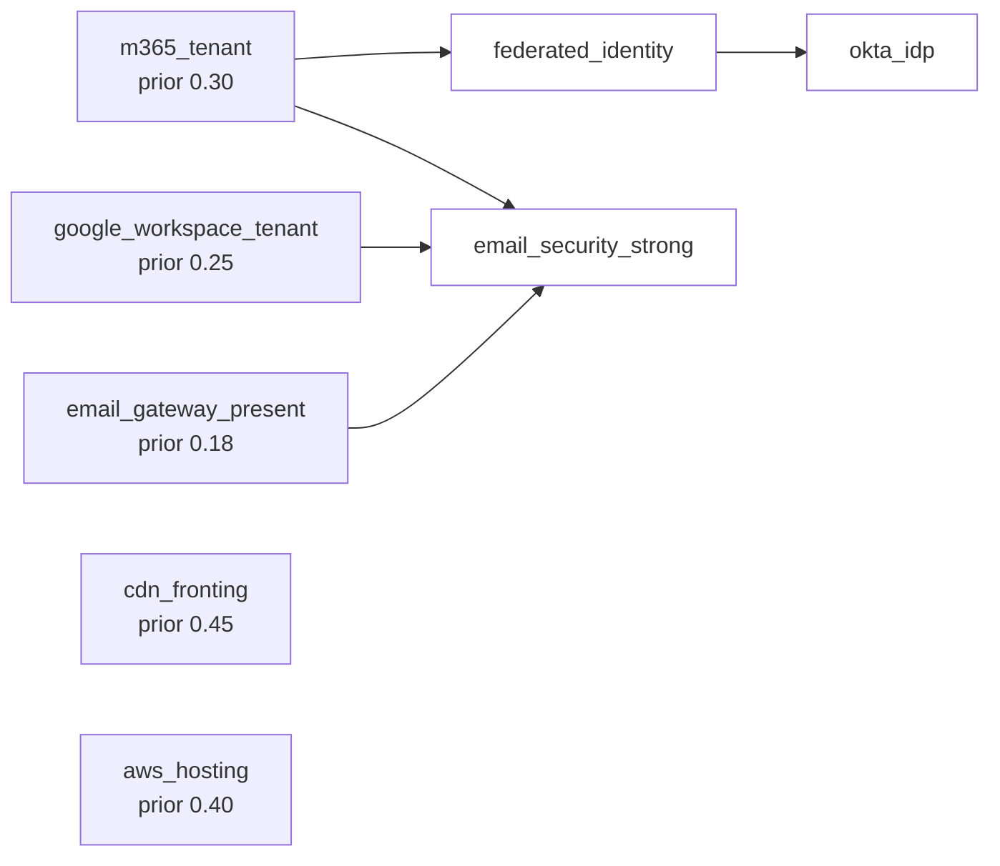
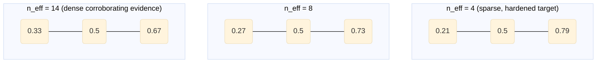

# Correlation engine

**Audience.** Security architects, researchers, and contributors who
want to understand *why* and *how* recon extracts structural signal from
strictly public observables. Casual users should rely on the
[README](../README.md) and `--explain` output. This is a living
technical reference; the v2.0 polish is a roadmap deliverable.

**TL;DR.** recon ingests three classes of public observables — DNS,
certificate transparency, and unauthenticated identity-discovery
endpoints — and runs three layered correlation engines on top of them:
deterministic rule-based fusion, deterministic graph correlation
(Louvain communities, chain motifs, hypergraph ecosystem view), and a
small probabilistic Bayesian network (v1.9, EXPERIMENTAL). The
contract throughout is **provenance + calibration**: every conclusion
is traceable through the evidence DAG, sparse evidence stays sparse,
and "we cannot tell from this channel" is a valid result. We do not
claim to recover an underlying ground-truth tech stack; we report how
much the public channel constrains the residual uncertainty about it.

## 1. What recon is doing, and what it is not

recon is an **external attack-surface management (EASM) instrument**
for defenders. The premise: the defender has already applied legal
and technical obscurity to their own public footprint. The question
recon answers is *how much of that footprint is still observable to
anyone with public DNS and certificate-transparency access* — i.e.,
how effective the obscurity is in practice.

The observables we work from are deliberately narrow:

  - $O_{\mathrm{DNS}}$ — DNS RRsets (A, CNAME, MX, NS, TXT, SPF, DMARC,
    DKIM, BIMI).
  - $O_{\mathrm{CT}}$ — CT log entries (issuer, SAN sets,
    `not_before` timestamps).
  - $O_{\mathrm{ID}}$ — unauthenticated identity-discovery endpoints
    (Microsoft 365 OIDC + GetUserRealm, Google Workspace).

The full observation tuple is $O = (O_{\mathrm{DNS}}, O_{\mathrm{CT}},
O_{\mathrm{ID}})$. Strictly passive: no probes beyond standard public-
DNS resolution, no credentials, no learned ML weights, no imported
intelligence databases. (See [roadmap.md § Invariants](roadmap.md#invariants).)

### Vocabulary

Two terms appear throughout and have specific meanings:

  - **Slug** — a stable identifier emitted by the deterministic
    fingerprint catalog (e.g. `microsoft365`, `okta`, `cloudflare`).
    Each slug is anchored in one or more YAML rules under
    `recon_tool/data/fingerprints/` that match against $O$.
  - **Signal** — a higher-order rule defined in
    `recon_tool/data/signals/` that fires conditional on slug sets,
    record patterns, or `requires`/`min_matches` predicates. Signals
    are observations *about* the slug evidence (e.g. `dmarc_reject`,
    `federated_sso_hub`).

A *node* in the v1.9 Bayesian network is yet another level up — a
high-level structural claim ("the tenant is M365-federated") whose
evidence bindings reference slugs and signals. The three abstractions
are intentionally layered, not merged; §4.8 develops the network
formally.

### Why these layers are separate (and stay separate)

A reasonable external critique reads the architecture as
"fingerprints → signals → optional Bayesian overlay" and proposes
collapsing it into one unified probabilistic model. We do not, and
the reason is structural rather than aesthetic:

  - **Slugs are the evidence layer.** Each slug is a falsifiable
    statement about $O$ (e.g. "this domain has an MX pointing to
    `aspmx.l.google.com`"). Slugs are what an auditor verifies by
    re-running the underlying DNS or CT query. They have to be
    addressable on their own, because the project's defensive posture
    is "every conclusion is reachable through the evidence DAG."
  - **The Bayesian network is the inference layer.** Nodes here are
    *latent* claims about the organization ("M365-federated tenant")
    that no single observable settles. They are exactly the place
    where probabilistic reasoning belongs, and the v1.9 layer is
    confined to this scope on purpose.
  - **Signals are the presentation layer.** They are operator-facing
    rollups that compose slug evidence into named ideas the operator
    already has a mental model for ("DMARC reject," "federated SSO
    hub"). They are not inference primitives — they are *views over*
    the evidence layer. Their value is that a security architect can
    cite `dmarc_reject` in a ticket without forcing every reader to
    re-derive it from RRsets.

Collapsing these three into one model is technically possible but
would erase the audit surface. An auditor who can only read posterior
probabilities — without being able to point at the slug that fired,
the network node it bound to, or the named signal a colleague is
referring to — cannot reconstruct the argument. That is the failure
mode the layering exists to prevent. Sections 4.1–4.7 stay
deterministic for the same reason: a deterministic conclusion is
auditable in a way a black-box posterior is not, even when the
posterior is numerically more honest.

This is also why the project does not adopt unified-PGM proposals
that ask signals to "disappear or become queries over the
posterior." The presentation layer exists for humans, not for the
inference engine. Removing it to satisfy a model-purity argument
would impose a tax on every operator who uses the tool to write a
finding.

### What this document does *not* claim

To preempt a reasonable critique: we do not claim recon optimizes any
information-theoretic objective end-to-end. The pipeline is
hand-crafted feature extractors and a fixed graphical model, not a
trained system that maximizes anything. The phrase "extracts residual
mutual information" describes the *intent* of the correlation work,
not an explicit objective being optimized over the tool's parameters.
Where we use the language of latent variables, posteriors, and
credible intervals (§4.8), it applies *only* to the discrete Bayesian
network defined in `bayesian_network.yaml` — not to the whole
pipeline. Sections 4.1–4.7 are deterministic; their outputs do not
carry posterior semantics.

## 2. Why the design choices are what they are

A defender's hardening strategy reduces how much structural
information the public channel reveals. recon's correlation work is
the counter-strategy: surface what still leaks. Each shipped feature
is a heuristic feature extractor over $O$. We did not derive these
extractors from an optimisation; we picked them because they recover
specific structural signals that single-source detection misses on
hardened targets (wildcard SAN siblings, temporal CT bursts, chain
motifs, SAN co-occurrence communities, network-propagated claims).

Two hard constraints govern every extractor:

  1. **Provenance.** Every conclusion is reachable through the
     evidence DAG (`--explain` and the `explanation_dag` field). A
     conclusion the operator cannot trace to specific observables is
     a conclusion they cannot audit.
  2. **Calibration honesty.** Sparse evidence produces wider hedges
     in language and (where applicable) wider credible intervals in
     numbers. "We cannot tell from this channel" is a valid
     output. Confident-looking output on sparse evidence is a
     calibration failure, not a feature.

These are the load-bearing commitments. Everything else — the lack
of telemetry, the data-file-only schema for fingerprints/CPTs, the
EXPERIMENTAL gating on the Bayesian layer — falls out of them.

## 3. Current implementation (v1.9.0)

Three layers ship side-by-side, in increasing order of statistical
machinery:

1. **Deterministic rule-based fusion** (the default path). Per-source
   evidence is merged into per-slug detections via explicit YAML rules.
   Output is a slug list with three-bucket confidence (`low / medium /
   high`) and full provenance through `--explain`. This is what the
   default panel reflects, and what every JSON consumer can rely on
   regardless of flags.
2. **Deterministic graph correlation** (v1.8.0, always emitted).
   Louvain community detection over the CT SAN co-occurrence graph
   plus chain-motif matching plus the batch-scope hypergraph view.
   Deterministic given a fixed Louvain seed; runs alongside the
   rule-based fusion without changing it.
3. **Probabilistic Bayesian-network fusion** (v1.9.0,
   `--fusion`-gated, EXPERIMENTAL). Variable-elimination inference
   over a small discrete DAG whose CPTs ship as a YAML data file.
   Surfaces marginal posteriors with 80% credible intervals over
   high-level claims (M365 tenant, federated identity, strong email
   security, etc.). The deterministic layer 1 still runs first; the
   Bayesian layer adds calibrated uncertainty without replacing the
   default output shape.

The three layers are deliberately complementary. Rule-based fusion is
the audit-friendly authority for "did we observe X?". The graph layer
is the structural lens — modularity, community boundaries, motif
hits — none of which a single-cert view recovers. The Bayesian layer
is the calibrated-uncertainty lens — when the public channel is thin,
it is the layer that refuses to overclaim. Sections 4.5 and 4.8 below
develop the graph and Bayesian layers in detail.

```mermaid
flowchart LR
  obs[O = O_DNS + O_CT + O_ID]
  obs --> rules[Layer 1<br/>Rule-based fusion<br/>slugs + signals]
  rules --> panel[Default panel<br/>+ JSON]
  obs --> graph[Layer 2<br/>Graph correlation<br/>communities + motifs]
  graph --> panel
  rules -. evidence chain .-> bn[Layer 3<br/>Bayesian network<br/>posteriors + intervals]
  bn -. --fusion only .-> panel

  style rules fill:#eef
  style graph fill:#efe
  style bn fill:#fee
```

Layer 1 is the authority for "did we observe X?" and feeds the
default panel. Layer 2 is always emitted into a top-level
infrastructure_clusters envelope, never gated. Layer 3 reads the
already-collected evidence chain — no new network calls — and
contributes posteriors only when `--fusion` is set.

Architecture:

  - `recon_tool/sources/dns.py` — collects DNS observables and the
    CNAME chains used by the surface-attribution pipeline.
  - `recon_tool/sources/cert_providers.py` — pulls CT entries from
    crt.sh and CertSpotter; surfaces SAN sets and basic cert summary
    statistics.
  - `recon_tool/fusion.py` — multi-source evidence merge into per-slug
    detections.
  - `recon_tool/merger.py` — deduplicates SourceResults into a single
    TenantInfo with full provenance and a `MergeConflicts` record when
    sources disagree.
  - `recon_tool/signals.py` — applies YAML rules (`requires`,
    `min_matches`, `expected_counterparts`) to produce signal-layer
    observations on top of fingerprint slugs.
  - `recon_tool/absence.py` — negative-space rules: when *expected*
    evidence is absent, surface the absence as an observation.
  - `recon_tool/posture.py` — neutral aggregation into the posture
    panel (Email / Identity / Infrastructure / SaaS / Consistency).
  - `recon_tool/clustering.py` — simple related-domain grouping for
    batch mode and chain expansion.
  - `recon_tool/discovery.py` — surface-attribution and gap-mining
    layer added in v1.5; the building block the discovery loop
    (`recon discover`, `validation/scan.py`) sits on top of.
  - `recon_tool/explanation.py` — provenance DAG serialization for
    `--explain` and the MCP `explanation_dag` field.
  - `recon_tool/motifs.py` (v1.7+) — CNAME chain motif catalog and
    matcher; surfaced as the top-level `chain_motifs` array.
  - `recon_tool/infra_graph.py` (v1.8+) — CT co-occurrence graph
    builder + Louvain community detection (via pure-Python `networkx`).
    Surfaced as the top-level `infrastructure_clusters` envelope.
  - `recon_tool/ecosystem.py` (v1.8+) — batch-scope hypergraph builder
    over per-domain results. Behind `recon batch --json --include-ecosystem`.

For most domains, deterministic fusion is the right tool. It is
fast, explainable, auditable, and catches the high-confidence cases
without probabilistic machinery. The cases it misses are the
hardened ones — minimal DNS, randomized CNAMEs, short-lived certs,
wildcard SAN policies — and that is where the graph and Bayesian
layers do their work.

### 3.1 What each layer can and cannot resolve

| Layer | Resolves well | Limits |
|---|---|---|
| **Rule-based fusion** (default, deterministic) | Direct slug attribution from authoritative observables (OIDC tenant, DKIM signing, MX provider, vendor-specific TXT). High-precision when the channel publishes anything. | Misses hardened targets that publish nothing. No notion of "claim X is uncertain"; output buckets are `low/medium/high`. |
| **Graph correlation** (v1.8, deterministic, always emitted) | Structural signal across multiple domains: SAN co-occurrence communities, chain motif matches, ecosystem-level co-membership across a batch. Recovers vendor-order pattern when individual labels are randomized. | Operates on the *observed* graph — gives no ownership claim, only co-membership / co-issuance / co-motif. Modularity score is the calibrated handle on partition quality; low score is reported, not hidden. |
| **Bayesian network** (v1.9, EXPERIMENTAL, `--fusion`) | Calibrated posterior + 80% credible interval over a small set of high-level claims (M365 tenant, federated identity, strong email security, etc.) with cross-source-conflict dampening. Sparse-evidence cases produce wide intervals rather than confident-looking point estimates. | Posterior quality is bounded by CPT specification — a wrong CPT produces a tight interval around the wrong mean. Network is small (~8 nodes) and intentionally so. EXPERIMENTAL until corpus calibration validates. |

The three layers do not replace each other. The default panel is
the rule-based fusion. The graph layer is *always* emitted and
sits in a top-level `infrastructure_clusters` envelope. The
Bayesian layer is opt-in; when on, both `slug_confidences` (from
the older Beta layer) and `posterior_observations` (the v1.9
network layer) populate.

## 4. Extensions in the build plan

Every extension below is a feature extractor over $O$ that recovers
information the current deterministic engine misses on hardened
targets. Each lands as a YAML schema extension plus minimal engine
code, ships gated behind an explicit flag where the output is
experimental, and stays inside the invariants ([roadmap.md §
Invariants](roadmap.md#invariants)).

§§ 4.1-4.4 shipped in **v1.7.0** (hardened-target signal recovery).
§§ 4.5-4.7 shipped in **v1.8.0** (graph correlation). §§ 4.8-4.9 are
the v1.9 experimental Bayesian layer.

### 4.1 Wildcard SAN sibling expansion (v1.7.0)

When a CT entry contains `*.example.com`, the rest of the SAN list in
that same certificate is a candidate sibling set. Wildcards exist to
collapse SAN inventory; the surrounding SAN entries in the same
issuance are still public. Each sibling lands as `related_domains`
evidence with type `ct_san_sibling` and the source cert's
`not_before`. Hedged: "issued together; common ownership not
implied" — same-cert SAN sets are sometimes shared across tenants of
the same hosting provider.

*Defender use:* quantify how much subdomain inventory remains
observable through CT despite a wildcard policy.

### 4.2 Temporal CT issuance bursts (v1.7.0)

Treat issuance as a point process. For a given apex or issuer, the
timestamps $\{t_1, \dots, t_n\}$ are observable. A *burst* is a
connected component of the inter-arrival graph with edge threshold
$\Delta t < \tau$ (DBSCAN-style; $\tau$ on the order of minutes for
typical deployment cadence). Co-issued subdomains within a burst
become directed edges in the evidence DAG, weighted by
$w_{ij} \propto 1/\Delta t_{ij}$. Output language is neutral:
"co-issued within $\tau$ seconds" — never "same owner".

*Defender use:* detect deployment cadence even when individual
hostnames are randomized or short-lived.

### 4.3 CNAME / NS chain motifs (v1.7.0)

Each resolution path is a directed string $\pi(d) = h_1 \to h_2 \to
\dots \to h_k$. v1.7.0 adds a motif library at
`recon_tool/data/motifs.yaml` describing recurring vendor-order
patterns: `cloudflare → akamai → custom-origin`,
`fastly → azure-fd`, intra-vendor `tm → azurefd → msedge`, etc.
Pattern matching is regex over the chain string with chain length
capped at 4. Vertical absence rules can also fire on motifs.

*Defender use:* observe that randomized intermediate labels do not
hide a recurring vendor ordering.

### 4.4 Cross-source evidence conflict surfacing (v1.7.0)

`MergeConflicts` records when two sources disagree on a merged field
(display name, auth type, region, tenant ID, DMARC policy, Google auth
type). v1.7.0 promotes them to a top-level `evidence_conflicts` array
in `--json` and a section in `--explain`. v1.9 feeds the conflict
count into the Bayesian dampener (§4.8.4).

*Defender use:* surface drift between hardening signals — minimal DNS
that disagrees with public CT, MX that contradicts SPF, OIDC display
name that disagrees with BIMI VMC.

### 4.5 CT co-occurrence graph + Louvain community detection (v1.8.0)

Build an undirected multi-graph $G_{\mathrm{CT}} = (V_{\mathrm{CT}}, E_{\mathrm{CT}})$:
$V_{\mathrm{CT}}$ are domains observed in CT SAN sets, $E_{\mathrm{CT}}$
are weighted by shared cert ID, shared issuer, and temporal
proximity (the burst rule from §4.2). Run Louvain community
detection ([Blondel et al. 2008](https://doi.org/10.1088/1742-5468/2008/10/P10008))
via pure-Python `networkx`, maximizing modularity:

$$Q = \frac{1}{2m} \sum_{ij}\left[A_{ij} - \frac{k_i k_j}{2m}\right] \delta(c_i, c_j).$$

Louvain over Leiden because Leiden's well-connectedness guarantees
([Traag et al. 2019](https://doi.org/10.1038/s41598-019-41695-z)) pay
off on dense million-node graphs; our cluster passes cap at ~500
nodes where the partition-quality difference is negligible, and
`leidenalg` would pull in C extensions we don't need. Output is a
partition $\{C_1, \dots, C_k\}$ and the modularity score $Q$ — high
$Q$ means a meaningful boundary, low $Q$ means a coin flip; both
report honestly.

*Defender use:* validate that PKI segmentation holds at the public
observation layer, not just the internal one.

### 4.6 Hypergraph ecosystem view (v1.8.0, batch-only)

For corpus runs, treat the batch as a hypergraph $\mathcal{H} = (V, \mathcal{E})$:
hyperedges $e \in \mathcal{E}$ connect domains sharing an issuer, a
fingerprint slug set ($|\mathrm{slugs}(e)| \geq 3$), or a BIMI VMC
organization. Hyperedge size encodes "how many co-located
organizations sit behind the same broadcast signature". Surfaced
behind `--include-ecosystem`. Describes observed co-membership; not
ownership.

*Defender use:* multi-brand orgs see ecosystem-level coupling
invisible from any single domain's view.

### 4.7 Vertical-baseline anomaly rules (v1.8.0)

`verticals.yaml` defines an expected fingerprint distribution per
profile (fintech, healthcare, etc.). At runtime we compare the
observed signal mix against the baseline. The simplest formulation
is a KL-divergence proxy over vertical-relevant slugs; in practice
we ship readable absence rules (`expected: WAF`,
`expected: identity_provider`) and surface the deviation neutrally
("fintech profile expects WAF motif; not observed"). Anomalies are
observations, not verdicts.

*Defender use:* sanity-check posture against industry norms encoded
as data, without recon ever asserting "you should do X".

### 4.8 Bayesian network fusion layer (v1.9.0, experimental)

The Bayesian layer is a small discrete graphical model
$\mathcal{B} = (V_\mathcal{B}, E_\mathcal{B}, \Phi)$ committed as a
YAML data file at `recon_tool/data/bayesian_network.yaml`. The model
is intentionally minimal — fewer than twenty nodes for the seed
network — because the goal is calibrated uncertainty over a handful
of high-level claims, not a comprehensive ontology of public
infrastructure. We make no claim that the network is the right
abstraction; we claim only that *given* the abstraction, the
inference is exact and the calibration is honest.

#### 4.8.1 Generative model

Each node $X \in V_\mathcal{B}$ is a binary latent variable with state
space $\{\text{present},\ \text{absent}\}$ representing a structural
claim ("the tenant is M365-federated", "email security is composite-
strong", "a CDN fronts the apex"). Each node has a conditional
probability table

$$\phi_X(X \mid \mathrm{Pa}(X)) = P(X \mid \mathrm{Pa}(X))$$

over its parents $\mathrm{Pa}(X)$, with the joint factorising in the
usual way:

$$P(V_\mathcal{B}) = \prod_{X \in V_\mathcal{B}} \phi_X(X \mid \mathrm{Pa}(X)).$$

Observables enter through *evidence bindings*. Each node $X$ has
zero or more bindings $b \in B(X)$, each pointing at a slug or signal
emitted by the deterministic pipeline. Conditional on $X$, the
binding's likelihood is

$$\ell_b(X) = \begin{cases}
   \alpha_b & \text{if } X = \text{present} \\
   \beta_b  & \text{if } X = \text{absent}
\end{cases}, \qquad \alpha_b, \beta_b \in (0, 1).$$

We restrict $\alpha_b, \beta_b$ to the open interval to keep all factors
strictly positive: hard-evidence likelihoods $\{0, 1\}$ would produce
degenerate factors that under-estimate uncertainty (a single
mis-fingerprint would pin a node permanently). The schema enforces
this at load time.

##### Concrete excerpt

This is the actual YAML the inference engine loads:

```yaml
nodes:
  - name: m365_tenant
    description: "Domain has a Microsoft 365 / Entra tenant."
    prior: 0.30
    evidence:
      - slug: microsoft365
        likelihood: [0.95, 0.03]   # P(observed | present), P(observed | absent)
      - slug: entra-id
        likelihood: [0.88, 0.02]
      - slug: exchange-online
        likelihood: [0.85, 0.02]

  - name: federated_identity
    description: "Domain uses an external IdP for SSO."
    parents: [m365_tenant]
    cpt:
      "m365_tenant=present": 0.45
      "m365_tenant=absent":  0.08
    evidence:
      - signal: federated_sso_hub
        likelihood: [0.90, 0.05]

  - name: okta_idp
    description: "Identity provider is Okta."
    parents: [federated_identity]
    cpt:
      "federated_identity=present": 0.30
      "federated_identity=absent":  0.005
    evidence:
      - slug: okta
        likelihood: [0.92, 0.02]
```

Read top-down: a tenant is M365 with prior probability 0.30; given
M365, federation is present with probability 0.45; given federation,
Okta is the IdP with conditional probability 0.30. The numbers are
tunable and explicitly committed as data — never learned, never
hidden behind a binary blob.

##### Network topology (seed)



Eight nodes total. Three roots (priors only); five children (CPTs).
Email-security-strong has three parents because the path through
M365, GWS, and email-gateway each contribute differently to a
strong-email-security posterior.

#### 4.8.2 Inference: variable elimination

Given an observed-evidence set $O = \{b : b \text{ fired for the queried domain}\}$,
the posterior over any node $X$ is

$$P(X \mid O) \;\propto\; \sum_{V_\mathcal{B} \setminus \{X\}}
P(V_\mathcal{B}) \cdot \prod_{b \in O} \ell_b(\mathrm{node}(b)).$$

We compute this exactly by variable elimination
([Zhang & Poole 1994](https://www.aaai.org/Library/AAAI/1994/aaai94-203.php),
[Koller & Friedman 2009 §9](https://mitpress.mit.edu/9780262013192)).
With $|V_\mathcal{B}| \leq 20$ and binary states the joint table has
at most $2^{20}$ entries, but in practice the seed network has eight
nodes (256 entries) and tree-width is bounded by the maximum number
of co-parents (here: three), so elimination is comfortably under a
millisecond. We use a deterministic elimination order (lexicographic
on node names) for reproducibility — this is far from the optimal
order in general but is tractable at this scale.

The implementation is pure Python, no numpy, no probabilistic
programming framework. We chose the small footprint deliberately:
adding a heavyweight inference dependency would obscure what is
actually a few hundred lines of straightforward factor manipulation.
For larger networks the code generalizes; we will reach for
`pgmpy` or similar only when the current implementation no longer
fits in a single readable module.

#### 4.8.3 The asymmetric likelihood: why we never condition on absence

A standard probabilistic model conditions on every observable —
positive or negative. That is, observing $\neg b$ (the binding did
*not* fire) would multiply the likelihood by $1 - \ell_b(X)$. We
deliberately do not do this.

The reason is a property of passive measurement, not laziness: when
recon does not observe slug $b$, two scenarios are indistinguishable
from the public channel:

1. The structural claim $X$ is genuinely absent (no M365, no Okta).
2. The claim is present, but $b$ is not exposed — for example,
   `microsoft365` did not fire because the operator hardened DNS to
   strip the public OIDC discovery, even though the tenant exists.

A model that conditions on absence treats both cases as identical
evidence against $X$, which is the classical "absence of evidence is
not evidence of absence" failure mode. Worse, it produces
*overconfident* posteriors against $X$ on hardened targets — exactly
the population that we want recon to refuse to overclaim about.

So the model is intentionally one-sided: positive bindings update the
posterior toward presence; non-firing bindings leave the posterior
where the priors and parent-claims placed it. Formally: the
likelihood factor for a node $X$ is the product over *only* the
bindings that fired,

$$L(O \mid X) = \prod_{b \in O \cap B(X)} \ell_b(X),$$

with the un-fired bindings contributing nothing.

This is not standard symmetric Bayesian conditioning. It is closer
to **Jeffrey-style updating** with one-sided evidence
([Jeffrey 1965](https://www.cambridge.org/core/books/logic-of-decision/B6AC0F4DDDF6E2BCB8985CB7CB7E1B59))
and to the **cautious-updating** treatments developed in imprecise-
probability theory
([Walley 1991](https://www.crcpress.com/Statistical-Reasoning-with-Imprecise-Probabilities/Walley/p/book/9780412286604);
[Augustin et al. 2014, *Introduction to Imprecise Probabilities*](https://onlinelibrary.wiley.com/doi/book/10.1002/9781118763117))
and in **forensic Bayesian networks**
([Taroni et al. 2014, *Bayesian Networks for Probabilistic Inference and Decision Analysis in Forensic Science*](https://onlinelibrary.wiley.com/doi/book/10.1002/9780470665879)),
where evidence is often one-sided by design (a fingerprint match is
informative; the absence of a match is mostly uninformative because
the surface that *could have* been matched against is unobserved).
We do not claim novelty — we claim that the formal framework for
"update on positive evidence only" exists in the literature, the
reasons it exists are the same reasons we apply it here (passive,
adversarial-hardening setting), and we are choosing it deliberately
rather than as an ad-hoc shortcut. The trade-off — some statistical
efficiency lost in well-instrumented domains, honesty preserved
under hardening — is the right one for a defensive tool. The choice
is annotated in `recon_tool/bayesian.py` so a future contributor who
reaches for symmetric conditioning reads the rationale first.

#### 4.8.4 Credible intervals: calibration over inference

Variable elimination gives us a single posterior $\hat{p} = P(X \mid O)$.
But a point estimate is not enough: a posterior of $0.85$ derived
from one weak observation should not be reported the same way as a
posterior of $0.85$ derived from five corroborating ones. We need a
calibrated interval that reflects evidence sparsity.

The standard approach in conjugate Bayesian analysis is to maintain
$\mathrm{Beta}(\alpha, \beta)$ posteriors over the parameter
directly. Variable elimination with discrete CPTs does not give us
$(\alpha, \beta)$ — it gives us a point posterior. We recover an
interval by treating $\hat{p}$ as the mean of an effective
$\mathrm{Beta}(\alpha_{\mathrm{eff}}, \beta_{\mathrm{eff}})$ with
total mass $n_{\mathrm{eff}}$:

$$\alpha_{\mathrm{eff}} = \hat{p} \cdot n_{\mathrm{eff}}, \qquad
  \beta_{\mathrm{eff}} = (1 - \hat{p}) \cdot n_{\mathrm{eff}}.$$

This is the *moment-matching* construction
([Minka 2001](https://tminka.github.io/papers/ep/minka-thesis.pdf) §3
gives the technique in a different context). It is not derived from
the network — it is a calibration *on top of* exact inference, and we
say so explicitly. The point of the construction is to give us a
two-parameter family with the right mean, whose interval shape
depends only on $n_{\mathrm{eff}}$.

The effective sample size is a deliberately conservative function of
the evidence count and the cross-source conflict count:

$$n_{\mathrm{eff}} = \max\left(n_{\min},\; n_{\min} + n_{\mathrm{ev}} \cdot c_{\mathrm{ev}} - n_{\mathrm{conf}} \cdot c_{\mathrm{conf}}\right)$$

where $n_{\min} = 4$ is the floor (the *passive-observation ceiling*
encoded in the math: even with abundant evidence, we never claim
better than $\mathrm{Beta}(\cdot, \cdot)$ with mass 4, because we
know we are inferring from a public broadcast channel rather than
authoritative inventory), $n_{\mathrm{ev}}$ is the count of bindings
that fired for this node, $n_{\mathrm{conf}}$ is the cross-source
conflict count from §4.4, and $(c_{\mathrm{ev}}, c_{\mathrm{conf}}) =
(1.0, 1.5)$ are the per-record contribution and per-conflict penalty.

The 80% credible interval is then the central 80% quantile of
$\mathrm{Beta}(\alpha_{\mathrm{eff}}, \beta_{\mathrm{eff}})$. We
approximate with a Wilson-style normal interval

$$\hat{p} \pm z_{0.80} \cdot \sqrt{\frac{\hat{p}(1-\hat{p})}{n_{\mathrm{eff}}}}, \qquad z_{0.80} \approx 1.282,$$

clipped to $[0, 1]$, which is accurate to $\pm 0.02$ against exact
Beta quantiles in our $n_{\mathrm{eff}}$ range. We chose 80% over the
more common 95% deliberately: the calibration here is heuristic on
top of exact inference, and a tighter band would over-promise
calibration we have not validated against ground truth (which we
cannot obtain in the passive setting). The choice is documented as a
fixed module-level constant so downstream consumers can rely on it.

We acknowledge two open issues in this construction:

1. **The interval is honest about sparsity, not about model
   misspecification.** A wrong CPT produces a tight interval around
   the wrong mean. We have no defense against that other than
   keeping the CPTs human-readable and committing them as data —
   plus the quantitative sensitivity analysis below, which bounds
   how much a single CPT error can move any posterior.
2. **The conflict penalty is global, not per-binding.** A conflict
   anywhere in the merged TenantInfo widens every node's interval,
   not just those whose bindings overlap the conflict. This is
   conservative — it never under-reports uncertainty — but it is
   coarser than ideal. A future iteration could thread per-node
   conflict overlap; we did not do so in v1.9 because the global
   penalty already produces the qualitative behavior the operator
   needs ("conflicts → wider report").

Both limitations are documented in `recon_tool/bayesian.py` so a
future contributor sees them next to the code.

##### Quantitative sensitivity to CPT misspecification

To bound the first limitation, we ran a $\pm 0.10$ perturbation
analysis: for every CPT entry and every root prior, perturb by
$\pm 0.10$ (clipped to $[0.001, 0.999]$), re-run inference on three
canonical evidence patterns (dense M365 stack, dense GWS stack,
empty observation), and record the maximum posterior shift across
all nodes. The numbers from `tests/test_bayesian_sensitivity.py`:

| Statistic | Posterior shift |
|---|---|
| Median across all perturbations | **0.019** |
| 95th percentile | **0.109** |
| Maximum observed | **0.139** |

That is, a $\pm 0.10$ error in any single CPT entry produces at
most a $\sim 0.14$ shift in any posterior on these scenarios, with
the median impact under $0.02$. This is the quantified version of
"the model is robust to small CPT errors": a thirteen-CPT-entry
network plus six priors gives the operator a 19-knob model where
no single knob has unbounded leverage. We do not claim the bound
is tight in all regimes — adversarial perturbation patterns or
joint shifts could push higher — but it is a meaningful regression
guard, and the test fails if the engine ever becomes more
amplifying.

##### Sparse vs dense, illustrated

Holding the point posterior at $\hat{p} = 0.5$ and varying $n_{\mathrm{eff}}$
gives the operator-facing story for why interval width is the
load-bearing field, not the mean:



Same point posterior, three reports. With $n_{\mathrm{eff}} = 4$
(passive-observation floor), the operator reads "we cannot tell
whether this claim holds — the public channel does not constrain
it." With $n_{\mathrm{eff}} = 14$, the operator reads "we have a
calibrated 50-50 reading and the channel does constrain it." This
is the calibration discipline the layer enforces in numbers, not in
prose.

#### 4.8.5 Identifiability and the passive-observation ceiling

A recurring question from formal-methods readers: is the model
identifiable? The answer is "no, deliberately, and we report the
non-identifiability rather than hide it."

A latent-variable model is *identifiable* if distinct parameter
settings produce distinct distributions over observables. In our
setting, two CPT parameterizations can produce identical observable
distributions when no evidence binding distinguishes them. With
$|B(X)| = 0$ (a node with no evidence bindings), the marginal
posterior collapses to the network's prior:

$$P(X \mid O) = P(X) \quad \text{whenever } B(X) \cap O = \emptyset.$$

This is mathematically identical to the deterministic engine
returning the prior on a hardened target — but the Bayesian layer
makes the non-identifiability *visible* via the credible interval.
A wide interval at $\hat{p} = 0.30$ is the layer saying "we have not
moved off the prior; do not over-interpret the point estimate."
The `sparse=true` flag in the JSON output is the operator-facing
shorthand for "this node is at the passive-observation ceiling."

The principle generalises: every flag we surface
(`sparse`, `interval_low/high`, `n_eff`, `evidence_used`) exists so
that an operator can ask "*why* does this posterior look like this?"
and get an answer in the same JSON object. There is no separate
calibration report; the calibration travels with the posterior.

#### 4.8.6 Relationship to the per-slug Beta layer (`fusion.py`)

A natural question: how does this layer relate to the existing
per-slug Beta posteriors in `recon_tool/fusion.py`? The two layers
operate at different levels of abstraction:

  - **Beta layer** ($\hat{p}_s$ over each slug $s$). Single-node
    conjugate update from an evidence-record stream. Models the
    question: *given this evidence chain, how confident are we that
    the deterministic pipeline correctly attributed slug $s$?* The
    answer is per-slug, the math is closed-form, and no inter-slug
    structure is encoded.
  - **Bayesian-network layer** ($\hat{p}_X$ over each network node
    $X$). Multi-node graphical-model update over a YAML-defined DAG.
    Models the question: *given everything observed, how confident
    are we that the high-level claim $X$ holds — accounting for
    parent dependencies and cross-source conflicts?*

They coexist on `--fusion`. Neither replaces the other: the Beta
layer is per-slug confidence the deterministic engine extracted; the
network layer is structural belief over claims that *use* those slugs
as evidence. A downstream consumer can read either or both depending
on the question. The schema fields `slug_confidences` and
`posterior_observations` are independent and both EXPERIMENTAL.

#### 4.8.7 Validation strategy

The layer is validated against four properties, three of them
publicly reproducible:

1. **Numerical correctness (publicly reproducible).** Inference
   matches hand-computed Bayes on the canonical Burglary-Earthquake-
   Alarm network ([Pearl 1988](https://www.cambridge.org/core/books/probabilistic-reasoning-in-intelligent-systems/0AA7BFAA1A4B5C9C6B68A4D4C8DB1C8E),
   [Russell & Norvig 3e §14.2](https://aima.cs.berkeley.edu/)) to four
   decimal places under the noisy-likelihood model the schema
   enforces. Reference tests in `tests/test_bayesian_canonical.py`.
2. **CPT sensitivity bound (publicly reproducible).** The
   $\pm 0.10$ perturbation analysis above quantifies model-
   misspecification robustness: median posterior shift 0.019, 95th
   percentile 0.109, max 0.139. Enforced as a regression guard in
   `tests/test_bayesian_sensitivity.py`.
3. **Synthetic-calibration ECE (publicly reproducible).**
   `validation/synthetic_calibration.py` simulates ground-truth
   parameter assignments from the network's own joint distribution,
   simulates evidence under the likelihoods, and computes Expected
   Calibration Error (ECE; [Naeini et al. 2015](https://ojs.aaai.org/index.php/AAAI/article/view/9602))
   conditional on at least one binding firing for the queried node.
   Current seed network (20,000 samples, seed 1729): conditional
   ECE $\approx 0.16$, marginal ECE $\approx 0.25$. The marginal-
   conditional gap is the asymmetric-likelihood design choice
   measured quantitatively — marginal calibration is sacrificed by
   design to refuse overconfident verdicts in the no-evidence-fired
   regime; conditional calibration is the claim the model actually
   makes.
4. **Real-corpus calibration (private).** On a private 50–100 domain
   validation corpus, posteriors above $0.85$ should correspond to
   deterministic-pipeline classifications in the high-confidence
   bucket; intervals on hardened-target subsets should remain wide
   (`sparse=true`). Tracked as the per-release north-star metric in
   `validation/v1.9-validation-summary.md`. The corpus stays
   private; only anonymized aggregates ship.
5. **Determinism (publicly reproducible).** Repeated inferences
   over identical inputs produce float-bit-identical posteriors
   and intervals. Verified across 100 sequential runs and 50
   concurrent `asyncio.gather` runs in
   `tests/test_v19_robustness.py`.

The decision to surface marginal vs conditional ECE separately is
deliberate. A reviewer who looks only at marginal calibration will
conclude the layer is poorly calibrated. They are correct: it is, in
the no-evidence regime, by design. The conditional figure is the one
the layer claims, and it is in the "acceptable but not ideal" band
($0.16$). That gap is exactly where v1.9.x catalog-tuning work
should focus — `email_security_strong` and `aws_hosting` have the
worst conditional ECE in the synthetic test, suggesting their
likelihoods need adjustment based on real-corpus observations.

#### 4.8.8 Defensive value

A defender who has hardened their public footprint wants to know: if
an attacker ran recon against them, what could the attacker actually
infer? The Bayesian layer answers that question with a credible
interval rather than a verdict. On a hardened target, the layer
prints "tentative low (interval [0.00, 0.45])" — telling the defender
their hardening is working, and quantifying how much residual signal
remains. On an under-hardened target, the layer prints "high-
confidence (interval [0.92, 1.00])" — telling the defender exactly
what is leaking, and via which observable.

Either way, the operator gets a calibrated posterior with full
provenance, not a black-box score they have to trust. That, more
than any specific feature, is what justifies the cost of shipping
the layer.

### 4.8a Worked `--explain-dag` examples (v1.9.0)

The Bayesian layer ships a renderer (`recon_tool/bayesian_dag.py`)
that walks the inference output as a plain-English narrative or as
Graphviz DOT. The narrative is what the agent or analyst reads; the
DOT artifact is what gets pasted into a ticket or a deck.

Below are four canonical shapes of `--explain-dag` output. The
domains used are the Microsoft fictional set; the technical
observations are illustrative of how the layer responds to those
shapes of evidence.

#### Example 1 — dense M365-federated stack

Input: `recon contoso.com --explain-dag`. The deterministic pipeline
fires `microsoft365`, `entra-id`, `okta`, `federated_sso_hub`,
`dmarc_reject`, `dkim_present`, `spf_strict`.

```
## m365_tenant
Domain has a Microsoft 365 / Entra tenant.

- Posterior: 1.000  (80% credible interval: [0.992, 1.000], n_eff=6.00)
- Confidence label: high-confidence
- Evidence: slug `microsoft365`, slug `entra-id`

## federated_identity
Domain uses an external IdP for SSO (Okta, Auth0, Ping, etc.).

- Posterior: 0.994  (80% credible interval: [0.951, 1.000], n_eff=5.00)
- Confidence label: high-confidence
- Evidence: signal `federated_sso_hub`
- Depends on: `m365_tenant` (posterior 1.000) — see CPT in
  bayesian_network.yaml for the conditional table.

## okta_idp
Identity provider is Okta.

- Posterior: 0.947  (80% credible interval: [0.819, 1.000], n_eff=5.00)
- Confidence label: high-confidence
- Evidence: slug `okta`
```

Reading: the chain reasoning is explicit. M365 is supported by two
direct slugs; federated identity is supported by a signal AND
propagates from the M365 parent (the CPT line `m365_tenant=present`
puts $P(\text{federated}|\text{M365}) = 0.45$); Okta then propagates
from `federated_identity`. Every claim in the chain is hedged with
a credible interval and an n_eff so a downstream reader can audit the
confidence rather than taking a single number on faith.

#### Example 2 — sparse hardened target

Input: a target with wildcard certs everywhere, minimal published
DNS, hardened IdP metadata. The pipeline fires only `cloudflare`
(because the apex CNAMEs to a CDN edge).

```
## m365_tenant
- Posterior: 0.300  (80% credible interval: [0.006, 0.594], n_eff=4.00, sparse)
- Confidence label: tentative low
- Evidence: no direct evidence (posterior follows network priors and parent claims)

## cdn_fronting
- Posterior: 0.962  (80% credible interval: [0.846, 1.000], n_eff=5.00)
- Confidence label: high-confidence
- Evidence: slug `cloudflare`

## federated_identity
- Posterior: 0.191  (80% credible interval: [0.000, 0.443], n_eff=4.00, sparse)
- Confidence label: tentative low
- Evidence: no direct evidence (posterior follows network priors and parent claims)
```

Reading: every node except `cdn_fronting` is `sparse`. The intervals
are wide. The narrative refuses to claim anything we did not
actually observe. This is the passive-observation ceiling enforced
in language: a hardened target produces a hedged, low-confidence
report — exactly what the v1.7-v1.9 thesis predicts.

#### Example 3 — cross-source conflict

Input: two sources disagree on `auth_type` (one says Federated, one
says Managed). The deterministic merger picks a winner and surfaces
the conflict in `evidence_conflicts`.

```
Inference summary: 5 bound observation(s) across 8 node(s); total
entropy reduction 0.873 nats; 1 cross-source conflict(s) dampening
intervals.

## federated_identity
- Posterior: 0.612  (80% credible interval: [0.020, 1.000], n_eff=2.50, sparse)
- Confidence label: tentative moderate
- Evidence: signal `federated_sso_hub`
- Depends on: `m365_tenant` (posterior 0.987) ...
```

Reading: the point estimate is moderate (0.61) but the interval is
huge — `[0.02, 1.00]`. The conflict subtracted from `n_eff`,
widening the interval. Operators see the disagreement reflected in
the report instead of getting a single number that hides it.

#### Example 4 — DOT export

Input: `recon contoso.com --explain-dag --explain-dag-format dot`.

```dot
digraph "recon_bayesian_contoso.com" {
  rankdir=LR;
  node [shape=box, style="rounded", fontname="Helvetica"];
  "m365_tenant" [label="m365_tenant\n...\nposterior 1.000\n[0.992, 1.000]",
                 style="rounded,solid", color="navyblue"];
  "federated_identity" [label="federated_identity\n...\nposterior 0.994\n[0.951, 1.000]",
                        style="rounded,solid", color="navyblue"];
  ...
  "m365_tenant" -> "federated_identity";
  "federated_identity" -> "okta_idp";
}
```

Pipe through `dot -Tpng > dag.png` for an image, or paste into
any Graphviz online viewer. Sparse nodes get dashed borders;
dense, high-posterior nodes get a navyblue solid border. The
palette is intentionally hedged: no green for "good", no red for
"bad" — recon renders structural confidence, not safety judgment.

### 4.9 Feedback-driven priors (v1.9.0, local only)

A corpus run can update a local prior file at
`~/.recon/priors.yaml` based on the validation run's findings.
Three guardrails:

  1. The priors file lives only on the operator's machine.
  2. The package never ships learned weights — only the corpus
     metadata that produced them, and only as documentation.
  3. There is no remote service. There is no telemetry. There is
     no shared reputation database.

This is "tune your local priors against your own corpus" —
specifically not "build a community-wide trust model". The
distinction is invariant.

**Defensive value.** Helps operators tune the Bayesian layer to
their own environment without ever ceding control of the prior to
a remote service or a shared model. The corpus stays private; the
priors stay local; the discipline stays the same.

## 5. Epistemology and the design choices that follow

### Bayesian epistemic humility in practice

Three principles connect the math above to the design constraints
the project ships under:

  1. **The public channel is adversarial by design.** A hardened
     defender minimizes $I(\Theta; O)$ as a deliberate strategy.
     recon's correlation work is the principled counter-strategy:
     extract the structural information that no public broadcast
     can avoid leaking (CT logs are append-only and globally
     visible; DNS delegation is hierarchical; issuance timing is
     governed by operational physics). It is not "clever hacks"
     against defenders; it is the defender themselves running
     their own counter-analysis.
  2. **Hedging is a calibration choice, not politeness.** Confident-
     looking output on sparse evidence is a calibration failure.
     The Bayesian layer enforces this in numbers (wider intervals
     under sparse evidence); the deterministic layer enforces it in
     language (`--confidence-mode strict` only fires when evidence
     is dense; sparse output stays qualified). Both are the same
     idea expressed in two registers.
  3. **Provenance is non-optional.** Every conclusion is reachable
     through the evidence DAG. The `--explain` output and the
     `explanation_dag` JSON field exist so a security architect
     can reconstruct exactly which observable produced which
     observation. A black-box posterior — even a numerically
     correct one — is unacceptable, because the defender cannot
     audit it. This rules out ML embeddings, learned weights, and
     any "trust the score" pattern.

These principles are why the invariants are what they are. They are
not arbitrary engineering taste — they are direct consequences of
treating recon as defensive epistemic infrastructure rather than as
a recon (offensive) tool.

## 6. How to read recon output through this lens

  - **Default panel** — the posterior mode + maximum-confidence
    slugs the deterministic engine extracted. Suitable for everyday
    review.
  - **`--full`** — the broader observation set, including
    surface-attribution map and the External surface section that
    walks each related subdomain's CNAME chain.
  - **`--explain`** — the evidence DAG. This is the authoritative
    answer to "why did recon say this?". Every conclusion is
    traceable to its observables.
  - **`--json` with `--include-unclassified`** — the discovery
    surface. Unclassified CNAME chains are observables we found but
    cannot yet attribute; they feed the validation loop and the
    `/recon-fingerprint-triage` skill.
  - **`--fusion`** *(experimental, v1.9.0+)* — Bayesian posteriors
    with credible intervals. Read intervals, not just means.

## 7. Alignment with invariants

Every extension above is gated by:

  - **Passive only.** No new probes beyond standard public-DNS
    resolution.
  - **Zero credentials, zero API keys, zero paid APIs.** Every
    source is reachable without an account.
  - **No bundled ML weights, embeddings, ASN/GeoIP databases, or
    aggregate intelligence.** The Bayesian layer ships data-file
    CPTs and exact inference; the graph layer ships data-file motif
    rules and a public graph algorithm. Neither is a learned model.
  - **No user-code plugin system.** Custom fingerprints, signals,
    motifs, and CPTs are data files only.
  - **Hedged output with full DAG provenance.** Sparse evidence
    stays qualified; dense evidence can be firmer; "we cannot tell
    from this channel" remains a valid result.

See [roadmap.md § Implementation discipline](roadmap.md#implementation-discipline-for-new-correlation-work)
for the per-PR checklist that turns these invariants into shippable
behavior.

## Relationship to other documents

- [README.md](../README.md) — user-facing introduction and practical
  usage. Casual readers start there.
- [roadmap.md](roadmap.md) — forward-looking build plan, success
  metrics, validation discipline.
- [schema.md](schema.md) — JSON output contract. Cited from this
  document whenever a new field is mentioned.
- [limitations.md](limitations.md) — known passive-collection
  ceilings. Pairs with §1–§2 above for cases where the channel
  genuinely cannot resolve uncertainty further.
- This document — formal model, mathematical rationale, per-feature
  defensive-value statements, and the epistemology that ties them
  together.
